# UniEvent - Atividades do Negócio

## 1. Índice

2. Objetivo  
3. Atividades do Negócio  
3.1. Atividade 1 - Acessar landing page  
3.1.1. Diagrama de Atividades  
3.2. Atividade 2 - Descobrir eventos públicos  
3.2.1. Diagrama de Atividades  
3.3. Atividade 3 - Filtrar eventos por instituição  
3.3.1. Diagrama de Atividades  
3.4. Atividade 4 - Ver detalhes do evento  
3.4.1. Diagrama de Atividades  
3.5. Atividade 5 - Cadastrar aluno institucional  
3.5.1. Diagrama de Atividades  
3.6. Atividade 6 - Selecionar instituição  
3.6.1. Diagrama de Atividades  
3.7. Atividade 7 - Confirmar e-mail  
3.7.1. Diagrama de Atividades  
3.8. Atividade 8 - Realizar login mobile  
3.8.1. Diagrama de Atividades  
3.9. Atividade 9 - Consultar eventos disponíveis  
3.9.1. Diagrama de Atividades  
3.10. Atividade 10 - Ver detalhes do evento no mobile  
3.10.1. Diagrama de Atividades  
3.11. Atividade 11 - Favoritar evento  
3.11.1. Diagrama de Atividades  
3.12. Atividade 12 - Inscrever-se em evento  
3.12.1. Diagrama de Atividades  
3.13. Atividade 13 - Visualizar meus eventos  
3.13.1. Diagrama de Atividades  
3.14. Atividade 14 - Visualizar ingresso  
3.14.1. Diagrama de Atividades  
3.15. Atividade 15 - Exibir QR Code do ingresso  
3.15.1. Diagrama de Atividades  
3.16. Atividade 16 - Gerenciar perfil  
3.16.1. Diagrama de Atividades  
3.17. Atividade 17 - Configurar preferências  
3.17.1. Diagrama de Atividades  
3.18. Atividade 18 - Realizar login web  
3.18.1. Diagrama de Atividades  
3.19. Atividade 19 - Cadastrar admin inicial  
3.19.1. Diagrama de Atividades  
3.20. Atividade 20 - Gerenciar instituições  
3.20.1. Diagrama de Atividades  
3.21. Atividade 21 - Cadastrar instituição  
3.21.1. Diagrama de Atividades  
3.22. Atividade 22 - Editar instituição  
3.22.1. Diagrama de Atividades  
3.23. Atividade 23 - Ativar ou desativar instituição  
3.23.1. Diagrama de Atividades  
3.24. Atividade 24 - Gerenciar usuários secretaria  
3.24.1. Diagrama de Atividades  
3.25. Atividade 25 - Cadastrar usuário secretaria  
3.25.1. Diagrama de Atividades  
3.26. Atividade 26 - Aprovar, bloquear ou recusar secretaria  
3.26.1. Diagrama de Atividades  
3.27. Atividade 27 - Consultar dashboard administrativo  
3.27.1. Diagrama de Atividades  
3.28. Atividade 28 - Executar automações manualmente  
3.28.1. Diagrama de Atividades  
3.29. Atividade 29 - Consultar dashboard da instituição  
3.29.1. Diagrama de Atividades  
3.30. Atividade 30 - Gerenciar eventos da instituição  
3.30.1. Diagrama de Atividades  
3.31. Atividade 31 - Cadastrar evento  
3.31.1. Diagrama de Atividades  
3.32. Atividade 32 - Editar evento  
3.32.1. Diagrama de Atividades  
3.33. Atividade 33 - Excluir evento  
3.33.1. Diagrama de Atividades  
3.34. Atividade 34 - Definir público permitido  
3.34.1. Diagrama de Atividades  
3.35. Atividade 35 - Gerenciar responsáveis  
3.35.1. Diagrama de Atividades  
3.36. Atividade 36 - Gerenciar certificados  
3.36.1. Diagrama de Atividades  
3.37. Atividade 37 - Validar check-in  
3.37.1. Diagrama de Atividades  
3.38. Atividade 38 - Informar código do QR Code  
3.38.1. Diagrama de Atividades  
3.39. Atividade 39 - Verificar janela de horário  
3.39.1. Diagrama de Atividades  
3.40. Atividade 40 - Emitir certificado automaticamente  
3.40.1. Diagrama de Atividades  
3.41. Atividade 41 - Enviar PDF do certificado por e-mail  
3.41.1. Diagrama de Atividades  
3.47. Atividade 47 - Consultar Meus Ingressos  
3.47.1. Diagrama de Atividades  

## 2. Objetivo

Este documento tem como objetivo descrever as principais atividades do negócio representadas pelos diagramas de atividades do sistema UniEvent. As atividades foram elaboradas a partir dos casos de uso especificados para a plataforma web pública, aplicativo mobile dos alunos Fatec, área administrativa do Admin UniEvent, área institucional da secretaria, serviço de e-mail e automações do backend.

Os diagramas demonstram o fluxo de interação entre os participantes do negócio e o sistema, incluindo decisões, validações, condições alternativas e resultados esperados para cada funcionalidade.

## 3. Atividades do Negócio

As atividades abaixo correspondem aos casos de uso documentados para o UniEvent. Cada atividade contém uma descrição textual do fluxo e o respectivo diagrama de atividades renderizado em imagem.

### 3.1. Atividade 1 - Acessar landing page

**Descrição textual:** Esta atividade representa o fluxo de negócio do caso de uso UC001 - Acessar landing page. O fluxo descreve as interações entre os participantes envolvidos e o sistema UniEvent até a conclusão da operação ou tratamento de uma exceção.

**Participantes:** Público Web, Sistema UniEvent.

**Fluxo da atividade:**
1. Público Web: Acessa a URL pública do UniEvent.
2. Sistema UniEvent: Carrega landing page.
3. Sistema UniEvent: Exibe informações gerais.
4. Sistema UniEvent: Exibe atalhos para eventos e login.
5. Sistema UniEvent: Navegador exibe erro de acesso.

**Condições e quebras de fluxo:**
- Aplicação web disponível?.

### 3.1.1. Diagrama de Atividades

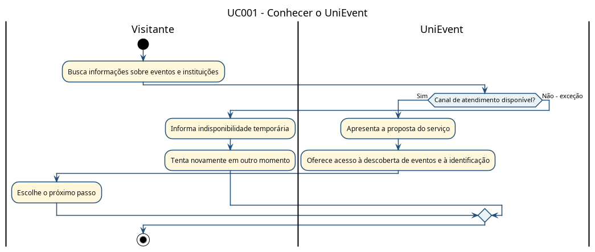

### 3.2. Atividade 2 - Descobrir eventos públicos

**Descrição textual:** Esta atividade representa o fluxo de negócio do caso de uso UC002 - Descobrir eventos públicos. O fluxo descreve as interações entre os participantes envolvidos e o sistema UniEvent até a conclusão da operação ou tratamento de uma exceção.

**Participantes:** Público Web, Sistema UniEvent.

**Fluxo da atividade:**
1. Público Web: Acessa a página de descoberta de eventos.
2. Sistema UniEvent: Consulta eventos públicos disponíveis.
3. Sistema UniEvent: Monta listagem com dados resumidos.
4. Sistema UniEvent: Exibe eventos, datas, categorias e instituições.
5. Sistema UniEvent: Exibe mensagem de nenhum evento encontrado.

**Condições e quebras de fluxo:**
- Existem eventos públicos?.

### 3.2.1. Diagrama de Atividades

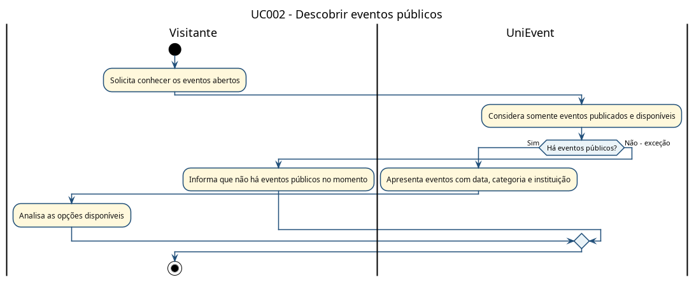

### 3.3. Atividade 3 - Filtrar eventos por instituição

**Descrição textual:** Esta atividade representa o fluxo de negócio do caso de uso UC003 - Filtrar eventos por instituição. O fluxo descreve as interações entre os participantes envolvidos e o sistema UniEvent até a conclusão da operação ou tratamento de uma exceção.

**Participantes:** Público Web, Sistema UniEvent.

**Fluxo da atividade:**
1. Público Web: Abre a listagem pública de eventos.
2. Sistema UniEvent: Carrega instituições cadastradas.
3. Público Web: Seleciona uma instituição no filtro.
4. Sistema UniEvent: Consulta eventos da instituição selecionada.
5. Sistema UniEvent: Atualiza a listagem com eventos filtrados.
6. Sistema UniEvent: Exibe mensagem informativa.
7. Sistema UniEvent: Exibe ausência de instituições cadastradas.

**Condições e quebras de fluxo:**
- Existem instituições disponíveis?.
- Existem eventos para a instituição?.

### 3.3.1. Diagrama de Atividades

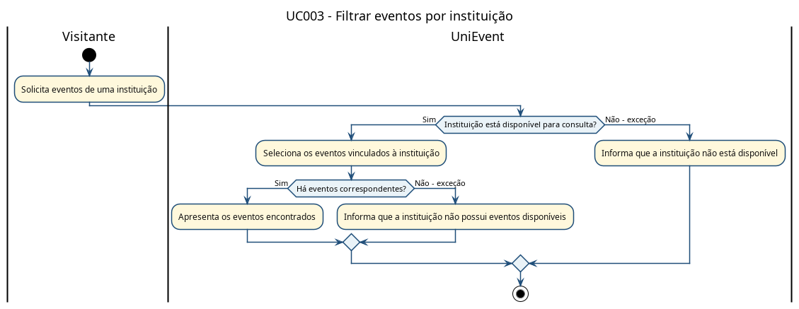

### 3.4. Atividade 4 - Ver detalhes do evento

**Descrição textual:** Esta atividade representa o fluxo de negócio do caso de uso UC004 - Ver detalhes do evento. O fluxo descreve as interações entre os participantes envolvidos e o sistema UniEvent até a conclusão da operação ou tratamento de uma exceção.

**Participantes:** Público Web, Sistema UniEvent.

**Fluxo da atividade:**
1. Público Web: Seleciona um evento na listagem.
2. Sistema UniEvent: Consulta evento pelo identificador.
3. Sistema UniEvent: Carrega nome, descrição, data, horário, local e instituição.
4. Sistema UniEvent: Exibe tela de detalhes do evento.
5. Sistema UniEvent: Exibe mensagem de indisponibilidade.

**Condições e quebras de fluxo:**
- Evento existe e está público?.

### 3.4.1. Diagrama de Atividades

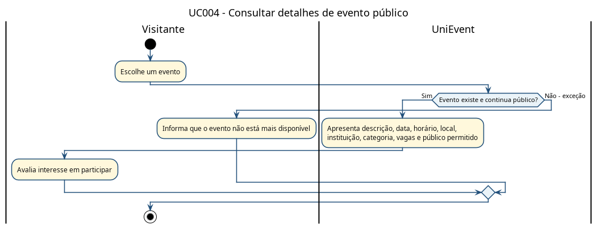

### 3.5. Atividade 5 - Cadastrar aluno institucional

**Descrição textual:** Esta atividade representa o fluxo de negócio do caso de uso UC005 - Cadastrar aluno institucional. O fluxo descreve as interações entre os participantes envolvidos e o sistema UniEvent até a conclusão da operação ou tratamento de uma exceção.

**Participantes:** Aluno Fatec (Mobile), Sistema UniEvent, Serviço de E-mail.

**Fluxo da atividade:**
1. Aluno Fatec (Mobile): Acessa a tela de cadastro.
2. Sistema UniEvent: Carrega instituições ativas.
3. Aluno Fatec (Mobile): Preenche nome, e-mail, senha, nascimento e foto.
4. Aluno Fatec (Mobile): Seleciona instituição.
5. Aluno Fatec (Mobile): Envia cadastro.
6. Sistema UniEvent: Valida dados obrigatórios.
7. Sistema UniEvent: Valida e-mail institucional e instituição ativa.
8. Sistema UniEvent: Cria conta do aluno.
9. Sistema UniEvent: Gera chave de confirmação.
10. Serviço de E-mail: Envia e-mail de confirmação.
11. Sistema UniEvent: Informa cadastro realizado.
12. Sistema UniEvent: Exibe erro de validação ou e-mail duplicado.

**Condições e quebras de fluxo:**
- Dados válidos e e-mail não cadastrado?.

### 3.5.1. Diagrama de Atividades

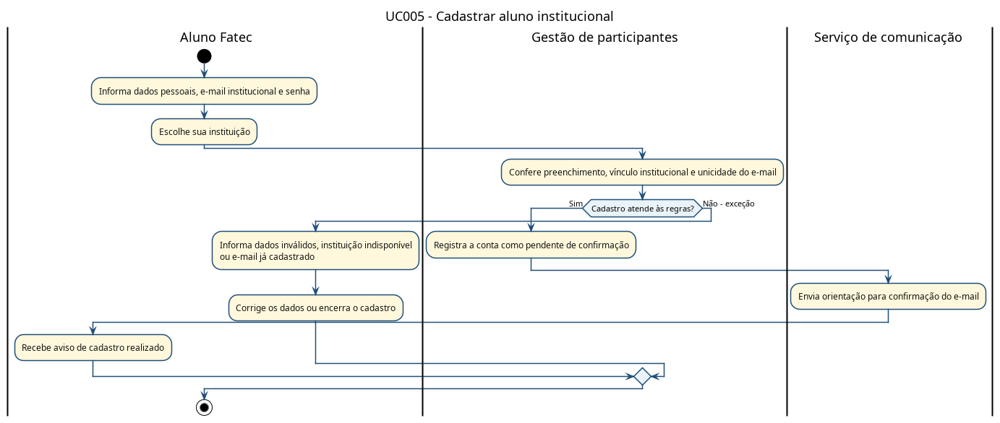

### 3.6. Atividade 6 - Selecionar instituição

**Descrição textual:** Esta atividade representa o fluxo de negócio do caso de uso UC006 - Selecionar instituição. O fluxo descreve as interações entre os participantes envolvidos e o sistema UniEvent até a conclusão da operação ou tratamento de uma exceção.

**Participantes:** Sistema UniEvent, Aluno Fatec (Mobile).

**Fluxo da atividade:**
1. Sistema UniEvent: Consulta instituições ativas.
2. Aluno Fatec (Mobile): Abre o campo de seleção.
3. Aluno Fatec (Mobile): Escolhe sua instituição.
4. Sistema UniEvent: Associa instituição ao formulário.
5. Sistema UniEvent: Informa que nenhuma instituição está cadastrada.

**Condições e quebras de fluxo:**
- Existem instituições ativas?.

### 3.6.1. Diagrama de Atividades

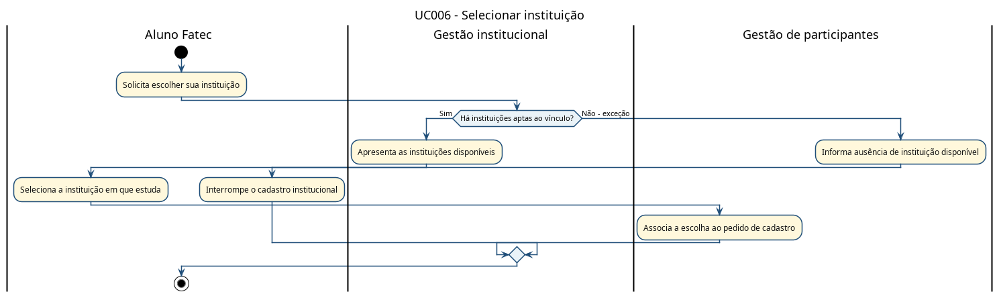

### 3.7. Atividade 7 - Confirmar e-mail

**Descrição textual:** Esta atividade representa o fluxo de negócio do caso de uso UC007 - Confirmar e-mail. O fluxo descreve as interações entre os participantes envolvidos e o sistema UniEvent até a conclusão da operação ou tratamento de uma exceção.

**Participantes:** Serviço de E-mail, Aluno Fatec (Mobile), Sistema UniEvent.

**Fluxo da atividade:**
1. Serviço de E-mail: Entrega link de confirmação ao usuário.
2. Aluno Fatec (Mobile): Acessa o link recebido.
3. Sistema UniEvent: Recebe chave de confirmação.
4. Sistema UniEvent: Marca conta como confirmada.
5. Sistema UniEvent: Exibe confirmação de sucesso.
6. Sistema UniEvent: Direciona para login.
7. Sistema UniEvent: Informa chave inválida ou expirada.

**Condições e quebras de fluxo:**
- Chave válida e não expirada?.

### 3.7.1. Diagrama de Atividades

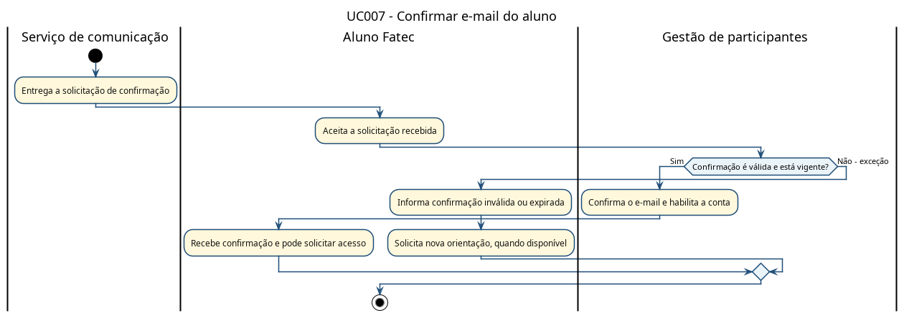

### 3.8. Atividade 8 - Realizar login mobile

**Descrição textual:** Esta atividade representa o fluxo de negócio do caso de uso UC008 - Realizar login mobile. O fluxo descreve as interações entre os participantes envolvidos e o sistema UniEvent até a conclusão da operação ou tratamento de uma exceção.

**Participantes:** Aluno Fatec (Mobile), Público Geral (Web), Sistema UniEvent.

**Fluxo da atividade:**
1. Aluno Fatec (Mobile): Informa e-mail e senha.
2. Aluno Fatec (Mobile): Solicita login.
3. Sistema UniEvent: Valida credenciais.
4. Sistema UniEvent: Verifica confirmação de e-mail.
5. Sistema UniEvent: Gera token de acesso.
6. Sistema UniEvent: Retorna dados do aluno.
7. Aluno Fatec (Mobile): Acessa tela inicial autenticada.
8. Aluno Fatec (Mobile): Bloqueia login e solicita confirmação de e-mail.
9. Aluno Fatec (Mobile): Informa credenciais inválidas.

**Condições e quebras de fluxo:**
- Credenciais corretas?.
- E-mail confirmado?.

### 3.8.1. Diagrama de Atividades

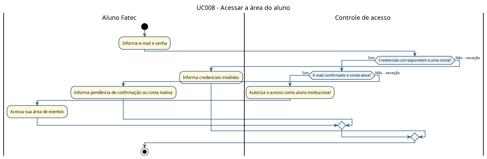

### 3.9. Atividade 9 - Consultar eventos disponíveis

**Descrição textual:** Esta atividade representa o fluxo de negócio do caso de uso UC009 - Consultar eventos disponíveis. O fluxo descreve as interações entre os participantes envolvidos e o sistema UniEvent até a conclusão da operação ou tratamento de uma exceção.

**Participantes:** Aluno Fatec (Mobile), Sistema UniEvent.

**Fluxo da atividade:**
1. Aluno Fatec (Mobile): Acessa a tela inicial.
2. Sistema UniEvent: Identifica aluno autenticado.
3. Sistema UniEvent: Consulta eventos disponíveis.
4. Sistema UniEvent: Aplica regras de público permitido.
5. Sistema UniEvent: Retorna lista de eventos.
6. Aluno Fatec (Mobile): Visualiza eventos disponíveis.
7. Aluno Fatec (Mobile): Retorna lista vazia.
8. Aluno Fatec (Mobile): Visualiza mensagem de ausência de eventos.

**Condições e quebras de fluxo:**
- Há eventos compatíveis?.

### 3.9.1. Diagrama de Atividades

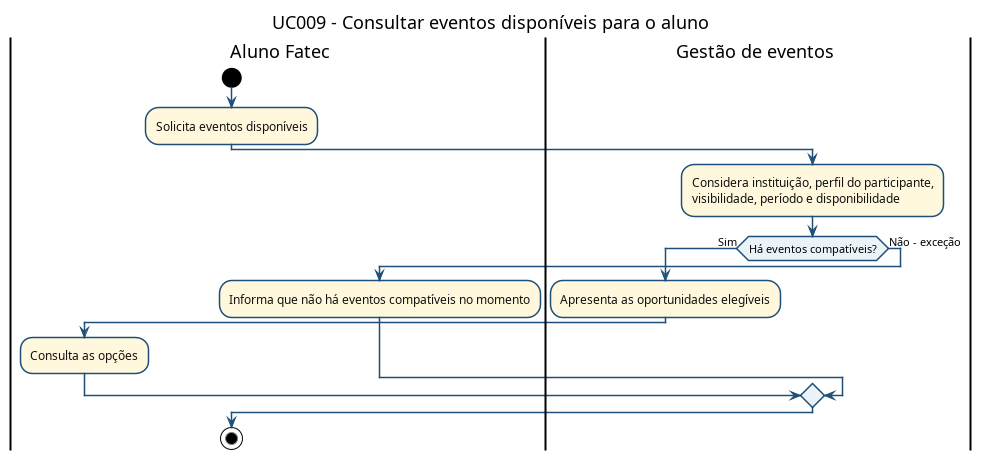

### 3.10. Atividade 10 - Ver detalhes do evento no mobile

**Descrição textual:** Esta atividade representa o fluxo de negócio do caso de uso UC010 - Ver detalhes do evento no mobile. O fluxo descreve as interações entre os participantes envolvidos e o sistema UniEvent até a conclusão da operação ou tratamento de uma exceção.

**Participantes:** Aluno Fatec (Mobile), Sistema UniEvent.

**Fluxo da atividade:**
1. Aluno Fatec (Mobile): Seleciona um evento.
2. Sistema UniEvent: Consulta detalhes do evento.
3. Sistema UniEvent: Verifica se o evento está disponível para o aluno.
4. Sistema UniEvent: Retorna dados completos e ações disponíveis.
5. Aluno Fatec (Mobile): Visualiza detalhes do evento.
6. Aluno Fatec (Mobile): Informa que o evento não está disponível.

**Condições e quebras de fluxo:**
- Evento disponível?.

### 3.10.1. Diagrama de Atividades

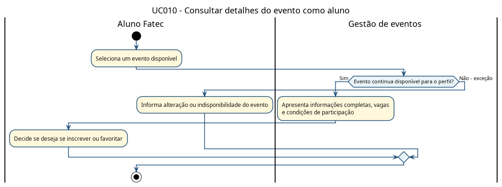

### 3.11. Atividade 11 - Favoritar evento

**Descrição textual:** Esta atividade representa o fluxo de negócio do caso de uso UC011 - Favoritar evento. O fluxo descreve as interações entre os participantes envolvidos e o sistema UniEvent até a conclusão da operação ou tratamento de uma exceção.

**Participantes:** Aluno Fatec (Mobile), Sistema UniEvent.

**Fluxo da atividade:**
1. Aluno Fatec (Mobile): Visualiza evento.
2. Aluno Fatec (Mobile): Aciona opção de favorito.
3. Sistema UniEvent: Adiciona ou remove evento dos favoritos.
4. Sistema UniEvent: Retorna estado atualizado.
5. Aluno Fatec (Mobile): Visualiza favorito atualizado.
6. Aluno Fatec (Mobile): Mantém estado anterior.
7. Aluno Fatec (Mobile): Exibe erro de comunicação.

**Condições e quebras de fluxo:**
- Operação pode ser concluída?.

### 3.11.1. Diagrama de Atividades

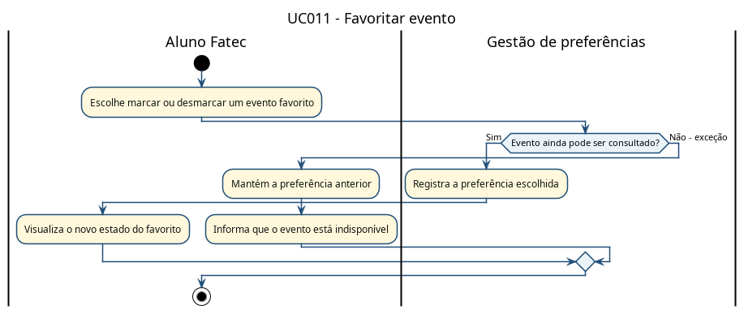

### 3.12. Atividade 12 - Inscrever-se em evento

**Descrição textual:** Esta atividade representa o fluxo de negócio do caso de uso UC012 - Inscrever-se em evento. O fluxo descreve as interações entre os participantes envolvidos e o sistema UniEvent até a conclusão da operação ou tratamento de uma exceção.

**Participantes:** Aluno Fatec (Mobile), Sistema UniEvent.

**Fluxo da atividade:**
1. Aluno Fatec (Mobile): Acessa detalhes do evento.
2. Aluno Fatec (Mobile): Solicita inscrição.
3. Sistema UniEvent: Valida autenticação do aluno.
4. Sistema UniEvent: Valida público permitido do evento.
5. Sistema UniEvent: Verifica inscrição existente.
6. Sistema UniEvent: Registra participação.
7. Sistema UniEvent: Gera ingresso/código de verificação.
8. Sistema UniEvent: Retorna confirmação de inscrição.
9. Aluno Fatec (Mobile): Visualiza inscrição confirmada.
10. Aluno Fatec (Mobile): Informa impedimento da inscrição.

**Condições e quebras de fluxo:**
- Aluno pode se inscrever?.

### 3.12.1. Diagrama de Atividades

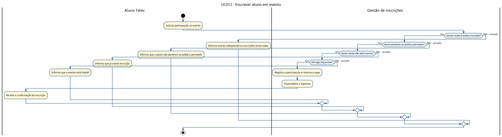

### 3.13. Atividade 13 - Visualizar meus eventos

**Descrição textual:** Esta atividade representa o fluxo de negócio do caso de uso UC013 - Visualizar meus eventos. O fluxo descreve as interações entre os participantes envolvidos e o sistema UniEvent até a conclusão da operação ou tratamento de uma exceção.

**Participantes:** Aluno Fatec (Mobile), Sistema UniEvent.

**Fluxo da atividade:**
1. Aluno Fatec (Mobile): Acessa Meus eventos.
2. Sistema UniEvent: Identifica aluno autenticado.
3. Sistema UniEvent: Consulta participações do aluno.
4. Sistema UniEvent: Retorna eventos e status de participação.
5. Aluno Fatec (Mobile): Visualiza lista de eventos inscritos.
6. Aluno Fatec (Mobile): Retorna estado vazio.
7. Aluno Fatec (Mobile): Visualiza mensagem de nenhuma inscrição.

**Condições e quebras de fluxo:**
- Existem eventos inscritos?.

### 3.13.1. Diagrama de Atividades

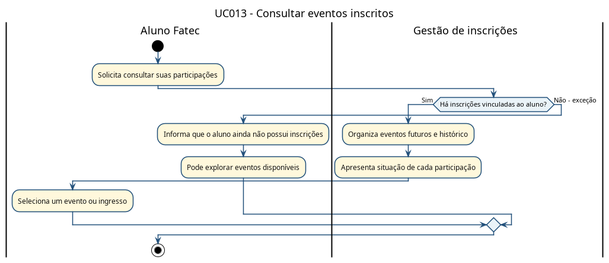

### 3.14. Atividade 14 - Visualizar ingresso

**Descrição textual:** Esta atividade representa o fluxo de negócio do caso de uso UC014 - Visualizar ingresso. O fluxo descreve as interações entre os participantes envolvidos e o sistema UniEvent até a conclusão da operação ou tratamento de uma exceção.

**Participantes:** Aluno Fatec (Mobile), Sistema UniEvent.

**Fluxo da atividade:**
1. Aluno Fatec (Mobile): Seleciona evento inscrito.
2. Aluno Fatec (Mobile): Solicita ingresso.
3. Sistema UniEvent: Consulta participação do aluno no evento.
4. Sistema UniEvent: Retorna ingresso com dados do evento e código.
5. Aluno Fatec (Mobile): Visualiza ingresso.
6. Aluno Fatec (Mobile): Informa que ingresso não está disponível.

**Condições e quebras de fluxo:**
- Participação existe?.

### 3.14.1. Diagrama de Atividades

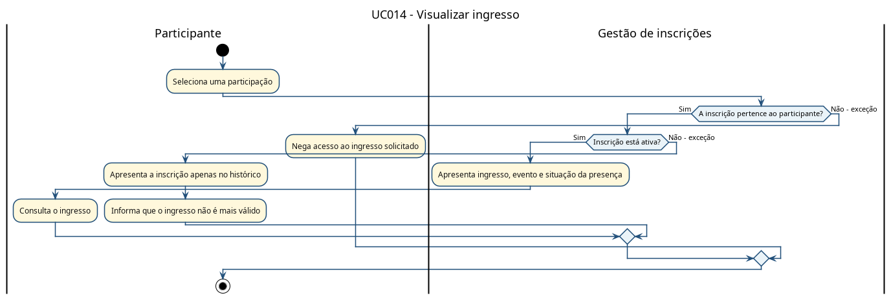

### 3.15. Atividade 15 - Exibir QR Code do ingresso

**Descrição textual:** Esta atividade representa o fluxo de negócio do caso de uso UC015 - Exibir QR Code do ingresso. O fluxo descreve as interações entre os participantes envolvidos e o sistema UniEvent até a conclusão da operação ou tratamento de uma exceção.

**Participantes:** Aluno Fatec (Mobile), Sistema UniEvent.

**Fluxo da atividade:**
1. O participante abre o ingresso no Mobile ou em `Meus Ingressos` na Web.
2. O sistema identifica o participante pelo JWT.
3. O sistema recupera o `CodigoIngresso` da própria participação.
4. O cliente codifica somente esse valor no QR Code e mantém o código textual como alternativa.
5. Inscrição cancelada ou erro de carregamento é informado sem exibir QR Code utilizável.

**Condições e quebras de fluxo:**
- Ingresso válido?.

### 3.15.1. Diagrama de Atividades

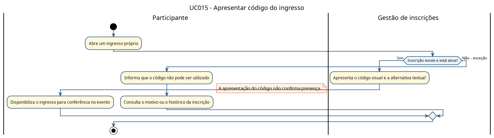

### 3.16. Atividade 16 - Gerenciar perfil

**Descrição textual:** Esta atividade representa o fluxo de negócio do caso de uso UC016 - Gerenciar perfil. O fluxo descreve as interações entre os participantes envolvidos e o sistema UniEvent até a conclusão da operação ou tratamento de uma exceção.

**Participantes:** Aluno Fatec (Mobile), Sistema UniEvent.

**Fluxo da atividade:**
1. Aluno Fatec (Mobile): Acessa tela de perfil.
2. Sistema UniEvent: Carrega dados cadastrados do aluno.
3. Aluno Fatec (Mobile): Altera dados desejados.
4. Aluno Fatec (Mobile): Solicita salvar alterações.
5. Sistema UniEvent: Valida campos enviados.
6. Sistema UniEvent: Atualiza perfil do aluno.
7. Sistema UniEvent: Retorna dados atualizados.
8. Sistema UniEvent: Exibe mensagens de validação.

**Condições e quebras de fluxo:**
- Dados válidos?.

### 3.16.1. Diagrama de Atividades

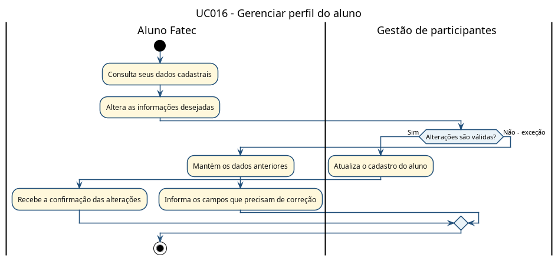

### 3.17. Atividade 17 - Configurar preferências

**Descrição textual:** Esta atividade representa o fluxo de negócio do caso de uso UC017 - Configurar preferências. O fluxo descreve as interações entre os participantes envolvidos e o sistema UniEvent até a conclusão da operação ou tratamento de uma exceção.

**Participantes:** Aluno Fatec (Mobile), Sistema UniEvent.

**Fluxo da atividade:**
1. Aluno Fatec (Mobile): Acessa tela de configurações.
2. Sistema UniEvent: Carrega preferências atuais.
3. Aluno Fatec (Mobile): Altera tema, acessibilidade ou opções disponíveis.
4. Sistema UniEvent: Salva/aplica preferência.
5. Sistema UniEvent: Atualiza experiência do usuário.
6. Sistema UniEvent: Mantém configuração anterior.
7. Sistema UniEvent: Informa falha ao salvar.

**Condições e quebras de fluxo:**
- Preferência pode ser aplicada?.

### 3.17.1. Diagrama de Atividades

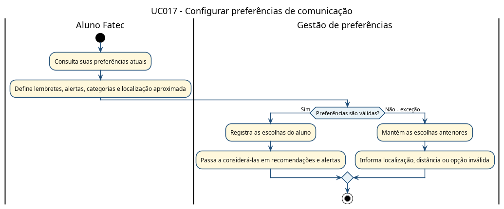

### 3.18. Atividade 18 - Realizar login web

**Descrição textual:** Esta atividade representa o fluxo de negócio do caso de uso UC018 - Realizar login web. O fluxo descreve as interações entre os participantes envolvidos e o sistema UniEvent até a conclusão da operação ou tratamento de uma exceção.

**Participantes:** Admin/Secretaria (Web), Sistema UniEvent.

**Fluxo da atividade:**
1. Admin/Secretaria (Web): Acessa tela de login web.
2. Admin/Secretaria (Web): Informa e-mail e senha.
3. Sistema UniEvent: Valida credenciais.
4. Sistema UniEvent: Verifica status e permissões do usuário.
5. Sistema UniEvent: Gera token JWT.
6. Sistema UniEvent: Identifica papel do usuário.
7. Admin/Secretaria (Web): É redirecionado para dashboard correspondente.
8. Admin/Secretaria (Web): Informa conta pendente, recusada ou bloqueada.
9. Admin/Secretaria (Web): Informa credenciais inválidas.

**Condições e quebras de fluxo:**
- Credenciais corretas?.
- Conta ativa e autorizada?.

### 3.18.1. Diagrama de Atividades

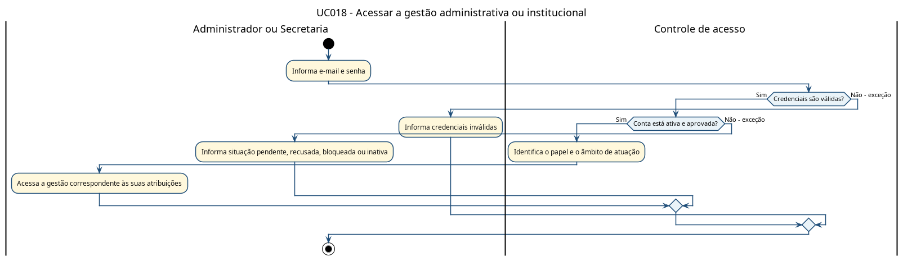

### 3.19. Atividade 19 - Cadastrar admin inicial

**Descrição textual:** Esta atividade representa o fluxo de negócio do caso de uso UC019 - Cadastrar admin inicial. O fluxo descreve as interações entre os participantes envolvidos e o sistema UniEvent até a conclusão da operação ou tratamento de uma exceção.

**Participantes:** Admin UniEvent (Web), Sistema UniEvent.

**Fluxo da atividade:**
1. Admin UniEvent (Web): Acessa cadastro de admin inicial.
2. Admin UniEvent (Web): Informa nome, e-mail e senha.
3. Sistema UniEvent: Verifica se já existe admin inicial.
4. Sistema UniEvent: Valida dados obrigatórios.
5. Sistema UniEvent: Cria usuário Admin UniEvent.
6. Sistema UniEvent: Confirma cadastro.
7. Sistema UniEvent: Exibe erros de validação.
8. Sistema UniEvent: Bloqueia criação de novo admin inicial.

**Condições e quebras de fluxo:**
- Cadastro inicial permitido?.
- Dados válidos?.

### 3.19.1. Diagrama de Atividades

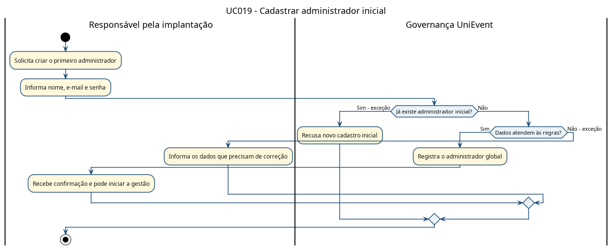

### 3.20. Atividade 20 - Gerenciar instituições

**Descrição textual:** Esta atividade representa o fluxo de negócio do caso de uso UC020 - Gerenciar instituições. O fluxo descreve as interações entre os participantes envolvidos e o sistema UniEvent até a conclusão da operação ou tratamento de uma exceção.

**Participantes:** Admin UniEvent (Web), Sistema UniEvent.

**Fluxo da atividade:**
1. Admin UniEvent (Web): Acessa área de instituições.
2. Sistema UniEvent: Valida autenticação e perfil Admin.
3. Sistema UniEvent: Lista instituições cadastradas.
4. Admin UniEvent (Web): Escolhe cadastrar, editar ou alterar status.
5. Sistema UniEvent: Executa ação selecionada.
6. Sistema UniEvent: Atualiza lista de instituições.
7. Sistema UniEvent: Bloqueia acesso.

**Condições e quebras de fluxo:**
- Usuário é Admin global?.

### 3.20.1. Diagrama de Atividades

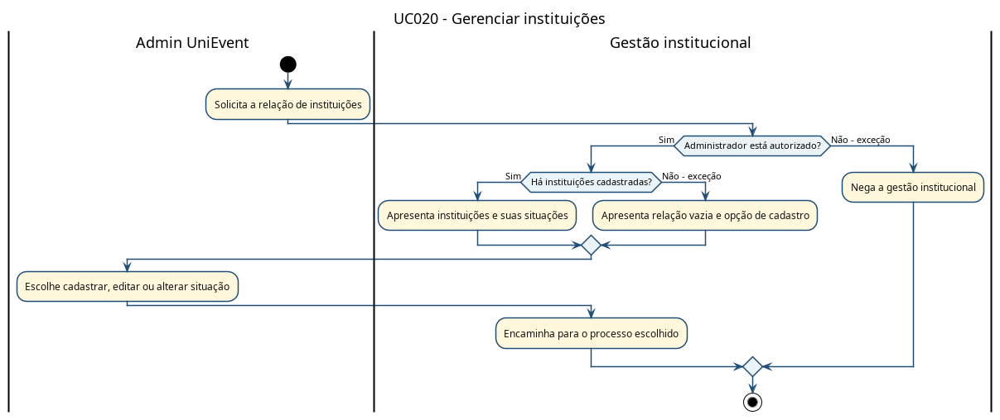

### 3.21. Atividade 21 - Cadastrar instituição

**Descrição textual:** Esta atividade representa o fluxo de negócio do caso de uso UC021 - Cadastrar instituição. O fluxo descreve as interações entre os participantes envolvidos e o sistema UniEvent até a conclusão da operação ou tratamento de uma exceção.

**Participantes:** Admin UniEvent (Web), Sistema UniEvent.

**Fluxo da atividade:**
1. Admin UniEvent (Web): Acessa formulário de nova instituição.
2. Admin UniEvent (Web): Informa nome, CNPJ, foto/logotipo e endereço.
3. Admin UniEvent (Web): Solicita cadastro.
4. Sistema UniEvent: Valida autenticação Admin.
5. Sistema UniEvent: Valida campos obrigatórios e CNPJ.
6. Sistema UniEvent: Salva instituição.
7. Sistema UniEvent: Disponibiliza instituição para vínculos.
8. Sistema UniEvent: Exibe erros de validação ou duplicidade.

**Condições e quebras de fluxo:**
- Dados válidos e CNPJ único?.

### 3.21.1. Diagrama de Atividades

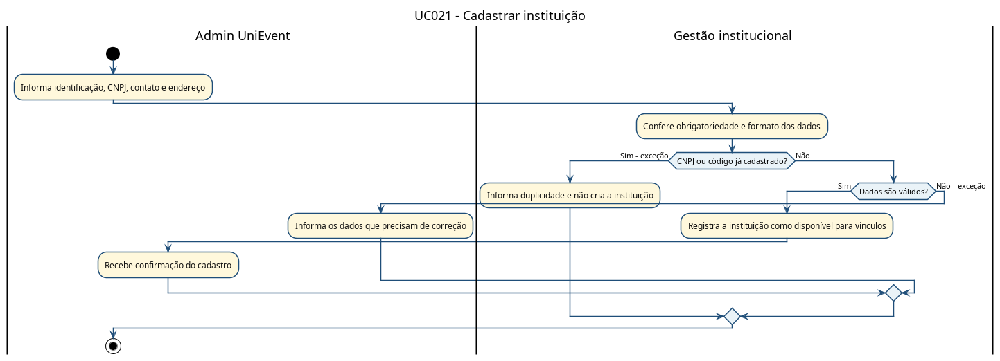

### 3.22. Atividade 22 - Editar instituição

**Descrição textual:** Esta atividade representa o fluxo de negócio do caso de uso UC022 - Editar instituição. O fluxo descreve as interações entre os participantes envolvidos e o sistema UniEvent até a conclusão da operação ou tratamento de uma exceção.

**Participantes:** Admin UniEvent (Web), Sistema UniEvent.

**Fluxo da atividade:**
1. Admin UniEvent (Web): Seleciona instituição para edição.
2. Sistema UniEvent: Busca dados atuais da instituição.
3. Admin UniEvent (Web): Altera dados cadastrais/endereço.
4. Admin UniEvent (Web): Solicita salvar.
5. Sistema UniEvent: Valida alterações.
6. Sistema UniEvent: Atualiza instituição.
7. Sistema UniEvent: Exibe erros de validação.
8. Sistema UniEvent: Informa instituição indisponível.

**Condições e quebras de fluxo:**
- Instituição encontrada?.
- Dados válidos?.

### 3.22.1. Diagrama de Atividades

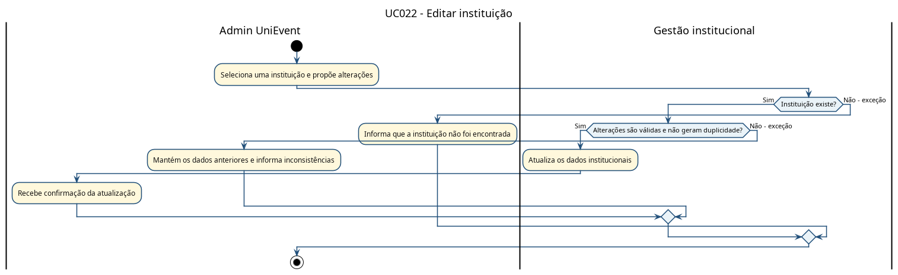

### 3.23. Atividade 23 - Ativar ou desativar instituição

**Descrição textual:** Esta atividade representa o fluxo de negócio do caso de uso UC023 - Ativar ou desativar instituição. O fluxo descreve as interações entre os participantes envolvidos e o sistema UniEvent até a conclusão da operação ou tratamento de uma exceção.

**Participantes:** Admin UniEvent (Web), Sistema UniEvent.

**Fluxo da atividade:**
1. Admin UniEvent (Web): Acessa lista de instituições.
2. Admin UniEvent (Web): Seleciona ativar ou desativar instituição.
3. Sistema UniEvent: Valida permissão Admin.
4. Sistema UniEvent: Consulta instituição selecionada.
5. Sistema UniEvent: Atualiza status da instituição.
6. Sistema UniEvent: Confirma alteração.
7. Sistema UniEvent: Informa motivo da impossibilidade.

**Condições e quebras de fluxo:**
- Alteração permitida?.

### 3.23.1. Diagrama de Atividades

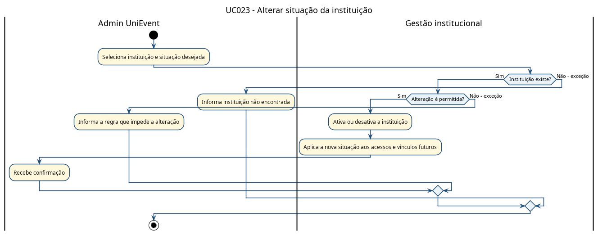

### 3.24. Atividade 24 - Gerenciar usuários secretaria

**Descrição textual:** Esta atividade representa o fluxo de negócio do caso de uso UC024 - Gerenciar usuários secretaria. O fluxo descreve as interações entre os participantes envolvidos e o sistema UniEvent até a conclusão da operação ou tratamento de uma exceção.

**Participantes:** Admin UniEvent (Web), Sistema UniEvent.

**Fluxo da atividade:**
1. Admin UniEvent (Web): Acessa área de secretarias.
2. Sistema UniEvent: Valida perfil Admin.
3. Sistema UniEvent: Lista usuários secretaria cadastrados.
4. Admin UniEvent (Web): Escolhe cadastrar ou alterar status.
5. Sistema UniEvent: Exibe estado vazio.
6. Admin UniEvent (Web): Pode iniciar novo cadastro.
7. Sistema UniEvent: Executa ação solicitada.

**Condições e quebras de fluxo:**
- Existem usuários cadastrados?.

### 3.24.1. Diagrama de Atividades

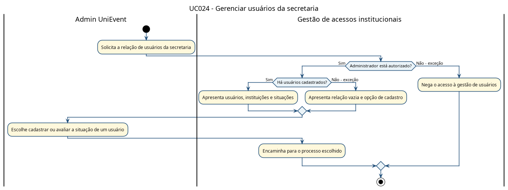

### 3.25. Atividade 25 - Cadastrar usuário secretaria

**Descrição textual:** Esta atividade representa o fluxo de negócio do caso de uso UC025 - Cadastrar usuário secretaria. O fluxo descreve as interações entre os participantes envolvidos e o sistema UniEvent até a conclusão da operação ou tratamento de uma exceção.

**Participantes:** Admin UniEvent (Web), Sistema UniEvent.

**Fluxo da atividade:**
1. Admin UniEvent (Web): Acessa formulário de usuário secretaria.
2. Sistema UniEvent: Carrega instituições cadastradas.
3. Admin UniEvent (Web): Informa nome, e-mail, senha, chave e instituição.
4. Admin UniEvent (Web): Solicita cadastro.
5. Sistema UniEvent: Valida dados, e-mail e instituição.
6. Sistema UniEvent: Cria usuário secretaria vinculado à instituição.
7. Sistema UniEvent: Exibe erro de validação.
8. Sistema UniEvent: Informa que é necessário cadastrar instituição.

**Condições e quebras de fluxo:**
- Existe instituição disponível?.
- Dados válidos?.

### 3.25.1. Diagrama de Atividades

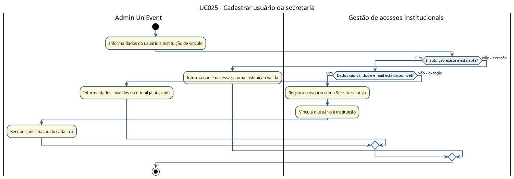

### 3.26. Atividade 26 - Aprovar, bloquear ou recusar secretaria

**Descrição textual:** Esta atividade representa o fluxo de negócio do caso de uso UC026 - Aprovar, bloquear ou recusar secretaria. O fluxo descreve as interações entre os participantes envolvidos e o sistema UniEvent até a conclusão da operação ou tratamento de uma exceção.

**Participantes:** Admin UniEvent (Web), Sistema UniEvent.

**Fluxo da atividade:**
1. Admin UniEvent (Web): Acessa lista de usuários secretaria.
2. Admin UniEvent (Web): Seleciona usuário.
3. Admin UniEvent (Web): Escolhe aprovar, bloquear ou recusar.
4. Sistema UniEvent: Consulta usuário secretaria.
5. Sistema UniEvent: Atualiza status selecionado.
6. Sistema UniEvent: Confirma alteração.
7. Sistema UniEvent: Informa que usuário não foi encontrado.

**Condições e quebras de fluxo:**
- Usuário encontrado?.

### 3.26.1. Diagrama de Atividades

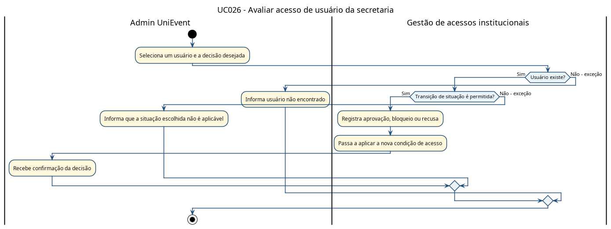

### 3.27. Atividade 27 - Consultar dashboard administrativo

**Descrição textual:** Esta atividade representa o fluxo de negócio do caso de uso UC027 - Consultar dashboard administrativo. O fluxo descreve as interações entre os participantes envolvidos e o sistema UniEvent até a conclusão da operação ou tratamento de uma exceção.

**Participantes:** Admin UniEvent (Web), Sistema UniEvent.

**Fluxo da atividade:**
1. Admin UniEvent (Web): Acessa dashboard administrativo.
2. Sistema UniEvent: Valida perfil Admin global.
3. Sistema UniEvent: Consulta métricas globais.
4. Sistema UniEvent: Calcula indicadores consolidados.
5. Sistema UniEvent: Exibe métricas de instituições, eventos, usuários, inscrições e certificados.
6. Sistema UniEvent: Exibe indicadores zerados.
7. Sistema UniEvent: Bloqueia acesso ao dashboard.

**Condições e quebras de fluxo:**
- Acesso autorizado?.
- Existem dados?.

### 3.27.1. Diagrama de Atividades

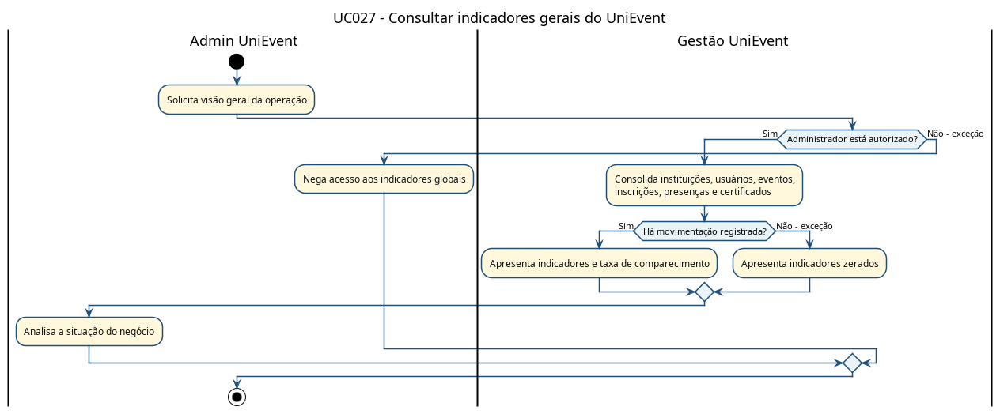

### 3.28. Atividade 28 - Executar automações manualmente

**Descrição textual:** Esta atividade representa o fluxo de negócio do caso de uso UC028 - Executar automações manualmente. O fluxo descreve as interações entre os participantes envolvidos e o sistema UniEvent até a conclusão da operação ou tratamento de uma exceção.

**Participantes:** Admin UniEvent (Web), Sistema UniEvent, Automação de Eventos.

**Fluxo da atividade:**
1. Admin UniEvent (Web): Acessa opção de automações.
2. Admin UniEvent (Web): Solicita processamento manual.
3. Sistema UniEvent: Valida perfil Admin.
4. Automação de Eventos: Executa rotina configurada.
5. Sistema UniEvent: Registra resultado do processamento.
6. Sistema UniEvent: Retorna status ao Admin.
7. Sistema UniEvent: Registra falha.
8. Sistema UniEvent: Informa indisponibilidade da automação.

**Condições e quebras de fluxo:**
- Automação disponível?.

### 3.28.1. Diagrama de Atividades

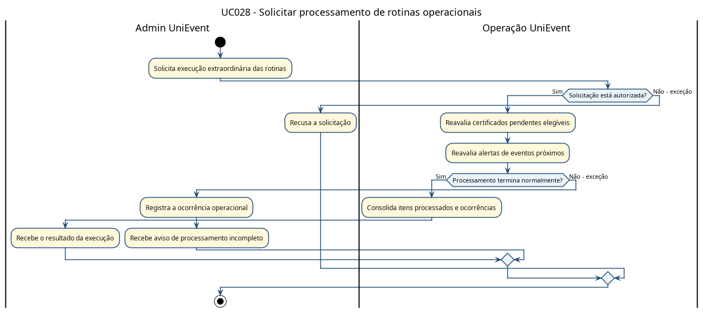

### 3.29. Atividade 29 - Consultar dashboard da instituição

**Descrição textual:** Esta atividade representa o fluxo de negócio do caso de uso UC029 - Consultar dashboard da instituição. O fluxo descreve as interações entre os participantes envolvidos e o sistema UniEvent até a conclusão da operação ou tratamento de uma exceção.

**Participantes:** Usuário Secretaria (Web), Sistema UniEvent.

**Fluxo da atividade:**
1. Usuário Secretaria (Web): Acessa dashboard institucional.
2. Sistema UniEvent: Valida autenticação da secretaria.
3. Sistema UniEvent: Obtém instituição pelo JWT.
4. Sistema UniEvent: Consulta indicadores da instituição.
5. Sistema UniEvent: Exibe eventos, inscrições, check-ins e certificados.
6. Sistema UniEvent: Bloqueia consulta e informa ausência de vínculo.

**Condições e quebras de fluxo:**
- Usuário possui instituição vinculada?.

### 3.29.1. Diagrama de Atividades

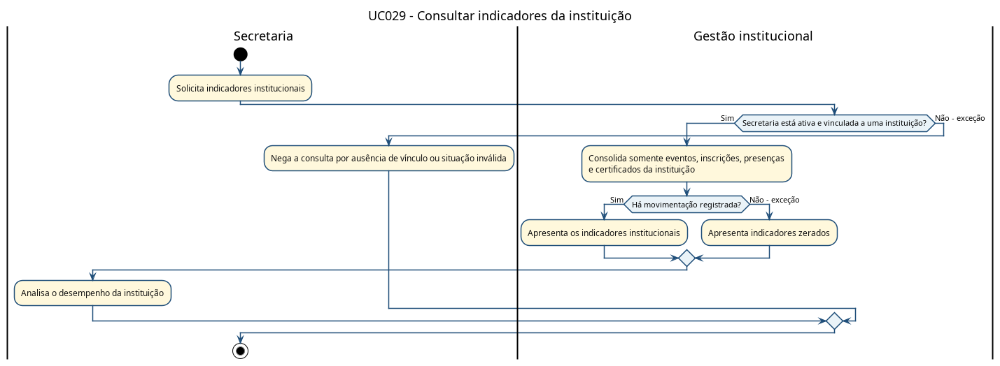

### 3.30. Atividade 30 - Gerenciar eventos da instituição

**Descrição textual:** Esta atividade representa o fluxo de negócio do caso de uso UC030 - Gerenciar eventos da instituição. O fluxo descreve as interações entre os participantes envolvidos e o sistema UniEvent até a conclusão da operação ou tratamento de uma exceção.

**Participantes:** Secretaria/Operador/Admin, Sistema UniEvent, Gerador de PDF, Serviço de E-mail e Automação.

**Fluxo da atividade:**
1. Usuário Secretaria/Admin (Web): Acessa área de eventos.
2. Sistema UniEvent: Valida autenticação e escopo institucional.
3. Sistema UniEvent: Lista eventos permitidos para o usuário.
4. Usuário Secretaria/Admin (Web): Seleciona cadastrar, editar, excluir ou configurar público.
5. Sistema UniEvent: Executa ação solicitada.
6. Sistema UniEvent: Atualiza lista de eventos.
7. Sistema UniEvent: Bloqueia ação por acesso institucional.

**Condições e quebras de fluxo:**
- Usuário possui permissão sobre o evento/instituição?.

### 3.30.1. Diagrama de Atividades

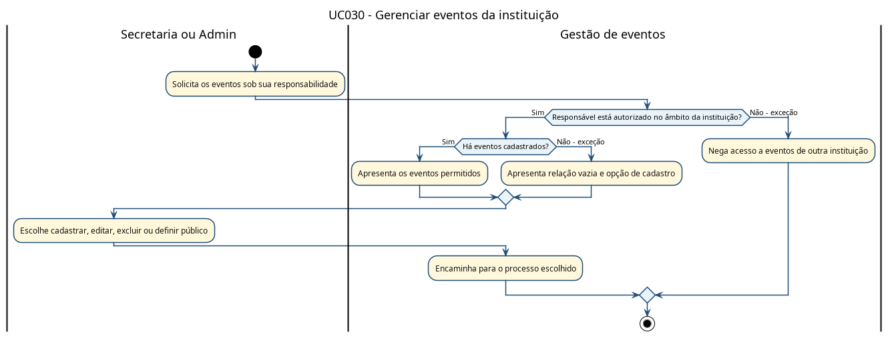

### 3.31. Atividade 31 - Cadastrar evento

**Descrição textual:** Esta atividade representa o fluxo de negócio do caso de uso UC031 - Cadastrar evento. O fluxo descreve as interações entre os participantes envolvidos e o sistema UniEvent até a conclusão da operação ou tratamento de uma exceção.

**Participantes:** Usuário Secretaria/Admin (Web), Sistema UniEvent.

**Fluxo da atividade:**
1. Usuário Secretaria/Admin (Web): Acessa formulário de evento.
2. Usuário Secretaria/Admin (Web): Informa nome, descrição, datas, horários, local, categoria, público, responsável e imagem.
3. Usuário Secretaria/Admin (Web): Solicita cadastro.
4. Sistema UniEvent: Valida autenticação e permissão.
5. Sistema UniEvent: Define instituição pelo usuário logado ou seleção do Admin.
6. Sistema UniEvent: Valida responsável, datas e campos obrigatórios.
7. Sistema UniEvent: Salva evento associado à instituição correta.
8. Sistema UniEvent: Confirma cadastro.
9. Sistema UniEvent: Exibe erros de validação.

**Condições e quebras de fluxo:**
- Dados válidos?.

### 3.31.1. Diagrama de Atividades

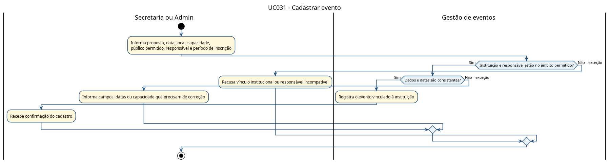

### 3.32. Atividade 32 - Editar evento

**Descrição textual:** Esta atividade representa o fluxo de negócio do caso de uso UC032 - Editar evento. O fluxo descreve as interações entre os participantes envolvidos e o sistema UniEvent até a conclusão da operação ou tratamento de uma exceção.

**Participantes:** Usuário Secretaria/Admin (Web), Sistema UniEvent.

**Fluxo da atividade:**
1. Usuário Secretaria/Admin (Web): Seleciona evento para edição.
2. Sistema UniEvent: Consulta evento e instituição vinculada.
3. Usuário Secretaria/Admin (Web): Altera campos desejados.
4. Usuário Secretaria/Admin (Web): Solicita salvar.
5. Sistema UniEvent: Valida dados alterados.
6. Sistema UniEvent: Atualiza evento.
7. Sistema UniEvent: Exibe erros de validação.
8. Sistema UniEvent: Bloqueia edição por escopo institucional.

**Condições e quebras de fluxo:**
- Usuário pode editar o evento?.
- Dados válidos?.

### 3.32.1. Diagrama de Atividades

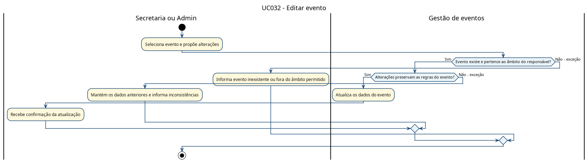

### 3.33. Atividade 33 - Excluir evento

**Descrição textual:** Esta atividade representa o fluxo de negócio do caso de uso UC033 - Excluir evento. O fluxo descreve as interações entre os participantes envolvidos e o sistema UniEvent até a conclusão da operação ou tratamento de uma exceção.

**Participantes:** Usuário Secretaria/Admin (Web), Sistema UniEvent.

**Fluxo da atividade:**
1. Usuário Secretaria/Admin (Web): Acessa lista de eventos.
2. Usuário Secretaria/Admin (Web): Solicita exclusão de evento.
3. Sistema UniEvent: Valida permissão sobre o evento.
4. Sistema UniEvent: Solicita confirmação.
5. Usuário Secretaria/Admin (Web): Confirma exclusão.
6. Sistema UniEvent: Remove ou marca evento como indisponível.
7. Sistema UniEvent: Confirma exclusão.
8. Sistema UniEvent: Informa vínculos que impedem exclusão.
9. Sistema UniEvent: Bloqueia exclusão.

**Condições e quebras de fluxo:**
- Usuário pode excluir?.
- Evento pode ser removido?.

### 3.33.1. Diagrama de Atividades

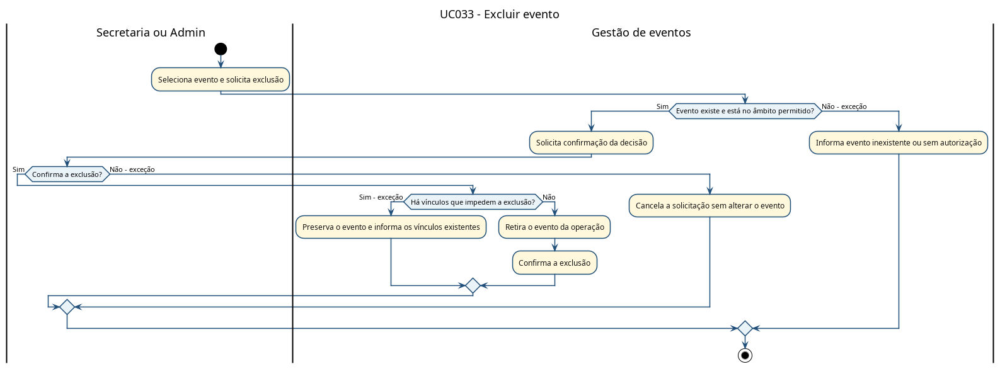

### 3.34. Atividade 34 - Definir público permitido

**Descrição textual:** Esta atividade representa o fluxo de negócio do caso de uso UC034 - Definir público permitido. O fluxo descreve as interações entre os participantes envolvidos e o sistema UniEvent até a conclusão da operação ou tratamento de uma exceção.

**Participantes:** Usuário Secretaria/Admin (Web), Sistema UniEvent.

**Fluxo da atividade:**
1. Usuário Secretaria/Admin (Web): Acessa formulário de cadastro ou edição de evento.
2. Usuário Secretaria/Admin (Web): Seleciona público permitido.
3. Sistema UniEvent: Valida opção selecionada.
4. Sistema UniEvent: Salva regra de público no evento.
5. Sistema UniEvent: Aplica regra em visualização e inscrição.
6. Sistema UniEvent: Solicita correção da opção.

**Condições e quebras de fluxo:**
- Opção válida?.

### 3.34.1. Diagrama de Atividades

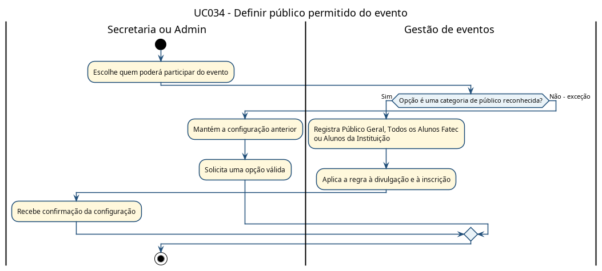

### 3.35. Atividade 35 - Gerenciar responsáveis

**Descrição textual:** Esta atividade representa o fluxo de negócio do caso de uso UC035 - Gerenciar responsáveis. O fluxo descreve as interações entre os participantes envolvidos e o sistema UniEvent até a conclusão da operação ou tratamento de uma exceção.

**Participantes:** Usuário Secretaria/Admin (Web), Sistema UniEvent.

**Fluxo da atividade:**
1. Usuário Secretaria/Admin (Web): Acessa área de responsáveis.
2. Sistema UniEvent: Valida acesso e lista responsáveis disponíveis.
3. Usuário Secretaria/Admin (Web): Escolhe cadastrar, editar ou remover responsável.
4. Usuário Secretaria/Admin (Web): Informa dados necessários.
5. Sistema UniEvent: Valida dados e vínculo institucional.
6. Sistema UniEvent: Salva alteração do responsável.
7. Sistema UniEvent: Exibe mensagem de validação.

**Condições e quebras de fluxo:**
- Dados válidos?.

### 3.35.1. Diagrama de Atividades

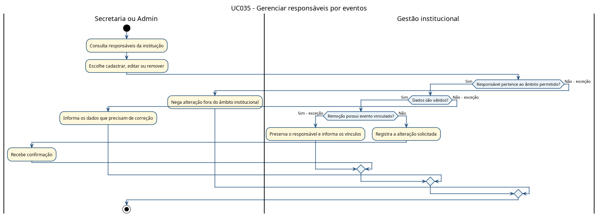

### 3.36. Atividade 36 - Gerenciar certificados

**Descrição textual:** Esta atividade representa o fluxo de negócio do caso de uso UC036 - Gerenciar certificados. O fluxo descreve as interações entre os participantes envolvidos e o sistema UniEvent até a conclusão da operação ou tratamento de uma exceção.

**Participantes:** Usuário Secretaria/Admin (Web), Sistema UniEvent.

**Fluxo da atividade:**
1. Usuário Secretaria/Admin (Web): Acessa área de certificados.
2. Sistema UniEvent: Valida acesso institucional.
3. Sistema UniEvent: Lista certificados cadastrados.
4. Usuário Secretaria/Admin (Web): Escolhe cadastrar, editar ou remover certificado.
5. Usuário Secretaria/Admin (Web): Informa texto e evento relacionado.
6. Sistema UniEvent: Valida evento e permissão.
7. Sistema UniEvent: Salva alteração do certificado.
8. Sistema UniEvent: Impede operação e informa erro.

**Condições e quebras de fluxo:**
- Evento existe e usuário pode acessar?.

### 3.36.1. Diagrama de Atividades

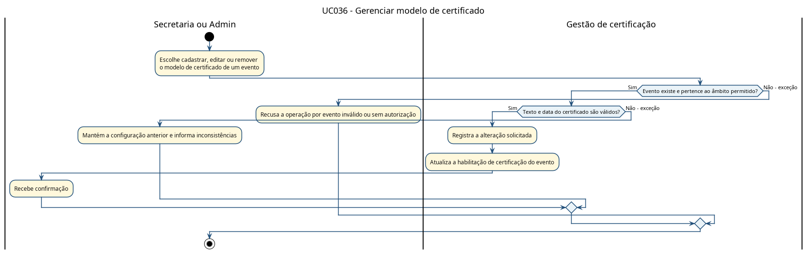

### 3.37. Atividade 37 - Validar check-in

**Descrição textual:** Esta atividade representa o fluxo de negócio do caso de uso UC037 - Validar check-in. O fluxo descreve as interações entre os participantes envolvidos e o sistema UniEvent até a conclusão da operação ou tratamento de uma exceção.

**Participantes:** Secretaria/Operador/Admin, Sistema UniEvent, Gerador de PDF, Serviço de E-mail e Automação.

**Fluxo da atividade:**
1. Secretaria/Operador/Admin informa evento e código do ingresso.
2. O sistema valida JWT, usuário ainda ativo, role atual e instituição do evento.
3. O sistema valida inscrição ativa, correspondência do código e janela de horário.
4. O sistema confirma a presença com atualização atômica.
5. Se a presença já estava confirmada, retorna sucesso sem gerar ou enviar novamente.
6. Na primeira confirmação, verifica se o evento possui template de certificado.
7. Se houver, reserva a participação, gera e persiste o PDF e tenta enviá-lo como anexo.
8. O sistema registra o resultado da entrega e mantém a presença confirmada mesmo em caso de falha.

**Condições e quebras de fluxo:**
- Operador autorizado e ativo para a instituição do evento?
- Código, evento, inscrição e janela são válidos?
- Presença já estava confirmada?
- Evento possui template e a participação está disponível para reserva?
- O resultado do e-mail permite retry seguro?

### 3.37.1. Diagrama de Atividades

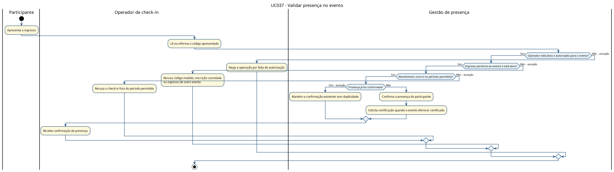

### 3.38. Atividade 38 - Informar código do QR Code

**Descrição textual:** Esta atividade representa o fluxo de negócio do caso de uso UC038 - Informar código do QR Code. O fluxo descreve as interações entre os participantes envolvidos e o sistema UniEvent até a conclusão da operação ou tratamento de uma exceção.

**Participantes:** Aluno FATEC ou Público Geral, Secretaria/Operador/Admin e Sistema UniEvent.

**Fluxo da atividade:**
1. Aluno FATEC ou Público Geral apresenta ingresso com QR Code.
2. Secretaria/Operador/Admin acessa a tela de check-in.
3. O operador informa o código do ingresso.
4. Sistema UniEvent: Recebe código.
5. Sistema UniEvent: Prepara dados para validação do check-in.
6. Sistema UniEvent: Solicita novo preenchimento do código.

**Condições e quebras de fluxo:**
- Código preenchido e legível?.

### 3.38.1. Diagrama de Atividades

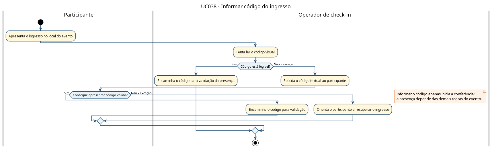

### 3.39. Atividade 39 - Verificar janela de horário

**Descrição textual:** Esta atividade representa o fluxo de negócio do caso de uso UC039 - Verificar janela de horário. O fluxo descreve as interações entre os participantes envolvidos e o sistema UniEvent até a conclusão da operação ou tratamento de uma exceção.

**Participantes:** Sistema UniEvent.

**Fluxo da atividade:**
1. Sistema UniEvent: Identifica evento relacionado ao código.
2. Sistema UniEvent: Consulta data e horário permitidos para check-in.
3. Sistema UniEvent: Obtém data e horário atuais.
4. Sistema UniEvent: Retorna permissão para continuar check-in.
5. Sistema UniEvent: Retorna bloqueio por fora da janela de horário.
6. Sistema UniEvent: Retorna bloqueio por evento inexistente.

**Condições e quebras de fluxo:**
- Evento encontrado?.
- Horário atual está dentro da janela?.

### 3.39.1. Diagrama de Atividades

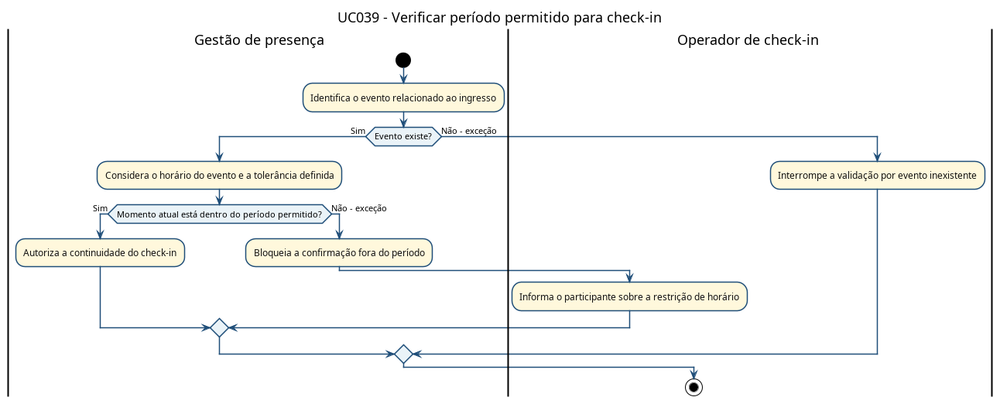

### 3.40. Atividade 40 - Emitir certificado automaticamente

**Descrição textual:** Esta atividade representa o fluxo de negócio do caso de uso UC040 - Emitir certificado. O fluxo descreve as interações entre os participantes envolvidos e o sistema UniEvent até a conclusão da operação ou tratamento de uma exceção.

**Participantes:** Sistema UniEvent, Gerador de PDF e Automação de Eventos.

**Fluxo da atividade:**
1. O sistema recebe a participação com presença confirmada e consulta o template do evento.
2. Sem template, encerra sem certificado e preserva a presença.
3. Com template, tenta reservar a participação atomicamente.
4. Se outra chamada reservou ou concluiu o processamento, retorna o estado existente.
5. O sistema define o código estável e reúne dados do participante, evento e instituição.
6. O gerador cria o PDF A4 paisagem.
7. O sistema persiste os bytes, nome, código, data e destinatário antes do SMTP.
8. Falha de preparação fica registrada sem desfazer presença.

**Condições e quebras de fluxo:**
- Existe template configurado?
- A reserva atômica foi obtida?
- O PDF foi gerado?

### 3.40.1. Diagrama de Atividades

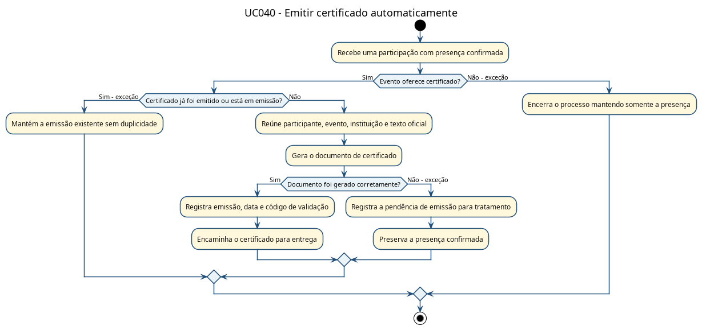

### 3.41. Atividade 41 - Enviar PDF do certificado por e-mail

**Descrição textual:** Esta atividade representa o fluxo de negócio do caso de uso UC041 - Enviar certificado por e-mail. O fluxo descreve as interações entre os participantes envolvidos e o sistema UniEvent até a conclusão da operação ou tratamento de uma exceção.

**Participantes:** Sistema UniEvent, Serviço de E-mail, Automação e participante destinatário.

**Fluxo da atividade:**
1. O sistema carrega o PDF persistido, o destinatário e a reserva atual.
2. O sistema marca a participação como `Enviando` por atualização condicional.
3. O serviço monta HTML escapado e anexa o PDF como `application/pdf`.
4. O SMTP tenta entregar a mensagem com `Message-ID` determinístico.
5. Sucesso registra `Enviado` e data.
6. Rejeição temporária registra `FalhaTemporaria` e agenda retry exponencial limitado.
7. Rejeição permanente registra `FalhaPermanente`.
8. Timeout/desconexão após o início registra `EnvioIncerto` e bloqueia retry automático.
9. Em todos os casos, o check-in permanece confirmado.

**Condições e quebras de fluxo:**
- A entrega ainda está elegível e reservada por este processo?
- O SMTP confirmou sucesso, rejeição temporária, rejeição permanente ou resultado incerto?

### 3.41.1. Diagrama de Atividades

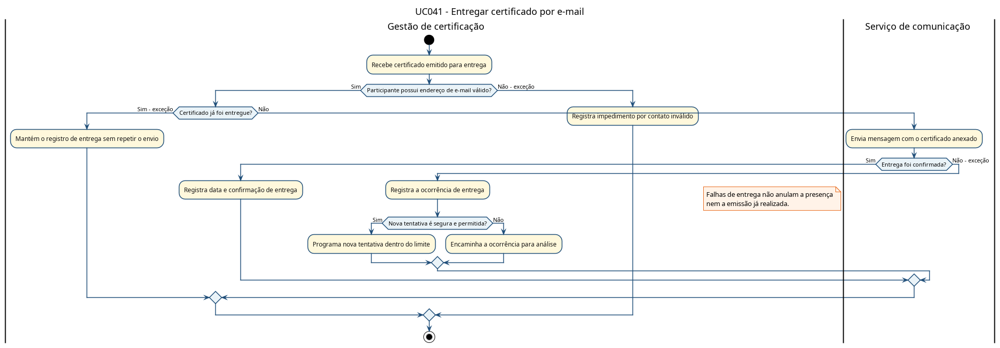

### 3.47. Atividade 47 - Consultar Meus Ingressos

**Descrição textual:** Esta atividade representa o fluxo do Público Geral desde a consulta dos próprios ingressos até a atualização do status depois do check-in institucional.

**Participantes:** Público Geral, Web React, API UniEvent e Secretaria/Operador.

**Fluxo da atividade:**
1. O Público Geral autenticado acessa `Meus Ingressos`.
2. A API obtém o participante do `NameIdentifier` do JWT e consulta somente suas participações.
3. A Web separa próximos eventos e histórico, com estados de inscrição e presença.
4. O participante abre um ingresso ativo e apresenta o QR Code que contém o `CodigoIngresso`.
5. A Secretaria lê o código e o backend valida operador, instituição, evento, inscrição ativa e janela.
6. A primeira validação confirma presença; repetições retornam o mesmo resultado sem duplicar o check-in.
7. Na próxima consulta, a Web mostra `Check-in realizado`.

**Condições e quebras de fluxo:**
- O usuário está autenticado como Público Geral?
- A participação pertence ao usuário do JWT?
- A inscrição está ativa?
- O código corresponde ao evento e à instituição do operador?
- O check-in já foi confirmado?

### 3.47.1. Diagrama de Atividades

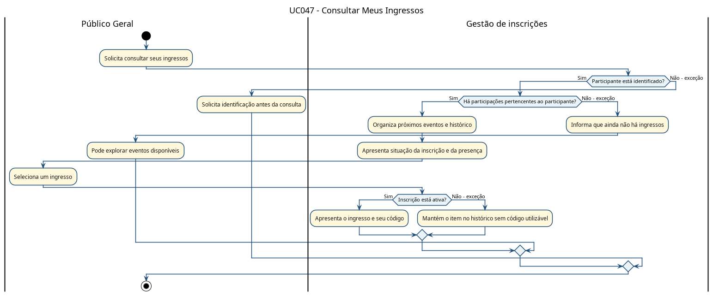
