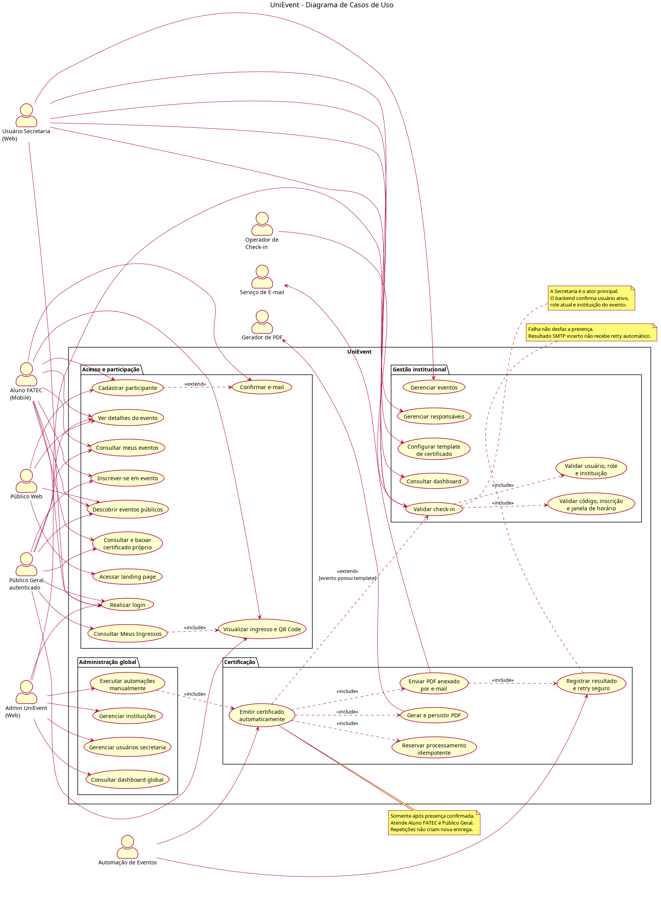

# UniEvent - Especificação de Casos de Uso do Sistema

## 1. Índice

2. Objetivo  
3. Atores do Sistema  
4. Diagrama de Casos de Uso  
5. Especificação dos Casos de Uso  

## 2. Objetivo

Este documento tem como objetivo especificar os casos de uso do sistema UniEvent, descrevendo as interações entre os atores e as funcionalidades disponíveis nas plataformas web e mobile.

O UniEvent permite a divulgação pública de eventos, a inscrição de alunos Fatec pelo aplicativo mobile, a gestão institucional por usuários da secretaria, a administração global pelo Admin UniEvent e a execução de processos automáticos relacionados a eventos, check-in e certificados.

## 3. Atores do Sistema

| Ator | Descrição | Principais permissões |
| --- | --- | --- |
| Público Web | Visitante que acessa a área pública do sistema pela web. | Visualizar landing page, descobrir eventos públicos, filtrar por instituição e criar conta pública. |
| Público Geral autenticado | Participante externo modelado como `Aluno` com `TipoParticipante.Externo`. | Inscrever-se em eventos públicos, consultar `Meus Ingressos`, apresentar QR Code, acompanhar presença e baixar o próprio certificado. |
| Aluno Fatec (Mobile) | Participante interno que usa o aplicativo mobile. | Cadastrar conta, confirmar e-mail, consultar eventos, inscrever-se, apresentar ingresso/QR Code, acompanhar presença e baixar o próprio certificado. |
| Usuário Secretaria (Web) | Usuário institucional vinculado a uma instituição. | Acessar dashboard, gerenciar eventos, responsáveis e templates de certificado e confirmar check-in de eventos da própria instituição. |
| Operador de Check-in | Usuário institucional ativo com permissão operacional. | Confirmar presença exclusivamente para eventos de sua instituição. |
| Admin UniEvent (Web) | Usuário administrativo global do sistema UniEvent. | Cadastrar admin inicial, gerenciar instituições, usuários secretaria, consultar dashboard administrativo e executar automações. |
| Serviço de E-mail | Serviço externo usado pelo sistema para envio de mensagens. | Enviar confirmação de conta e receber o PDF oficial como anexo na mensagem de certificado. |
| Automação de Eventos | Processo automático executado pelo backend. | Reprocessar falhas temporárias elegíveis e classificar reservas expiradas sem duplicar entregas. |

## 4. Diagrama de Casos de Uso

## 5. Especificação dos Casos de Uso

### 5.1. Caso de uso #001 - Acessar landing page

**Descrição:** Permite que o visitante acesse a página inicial pública do UniEvent.  
**Tipo:** Condução.  
**Atores que iniciam:** Público Web.  
**Pré-condições:** O sistema web deve estar disponível.  
**Pós-condições:** A página inicial pública é exibida.  
**Entradas:** Nenhuma.  
**Saídas:** Conteúdo institucional e atalhos de navegação para eventos e login.  
**Fluxo:**
1. O ator acessa a URL pública do sistema.
2. O sistema carrega a landing page.
3. O sistema exibe informações gerais e opções de navegação.

**Fluxos alternativos:** Se a aplicação estiver indisponível, o navegador exibirá erro de acesso.  
**Tipo de interface:** Web pública.

### 5.2. Caso de uso #002 - Descobrir eventos públicos

**Descrição:** Permite consultar eventos disponíveis para visualização pública na web.  
**Tipo:** Análise.  
**Atores que iniciam:** Público Web.  
**Pré-condições:** Existirem eventos públicos cadastrados.  
**Pós-condições:** A listagem de eventos públicos é apresentada.  
**Entradas:** Acesso à página de descoberta de eventos.  
**Saídas:** Lista de eventos, datas, categorias, instituições e informações resumidas.  
**Fluxo:**
1. O ator acessa a página de eventos.
2. O sistema busca eventos públicos disponíveis.
3. O sistema exibe a listagem com informações resumidas.

**Fluxos alternativos:** Se não houver eventos, o sistema informa que nenhum evento foi encontrado.  
**Tipo de interface:** Web pública.

### 5.3. Caso de uso #003 - Filtrar eventos por instituição

**Descrição:** Permite restringir a listagem pública de eventos por instituição cadastrada.  
**Tipo:** Análise.  
**Atores que iniciam:** Público Web.  
**Pré-condições:** Existirem instituições cadastradas e eventos associados.  
**Pós-condições:** A listagem passa a exibir apenas eventos da instituição selecionada.  
**Entradas:** Instituição selecionada no filtro.  
**Saídas:** Eventos filtrados por instituição.  
**Fluxo:**
1. O ator abre a listagem pública de eventos.
2. O sistema carrega as instituições cadastradas.
3. O ator seleciona uma instituição.
4. O sistema atualiza a listagem conforme a instituição selecionada.

**Fluxos alternativos:** Se não houver eventos para a instituição, o sistema exibe mensagem informativa.  
**Tipo de interface:** Web pública.

### 5.4. Caso de uso #004 - Ver detalhes do evento

**Descrição:** Permite visualizar informações completas de um evento público.  
**Tipo:** Análise.  
**Atores que iniciam:** Público Web.  
**Pré-condições:** O evento deve existir e estar disponível para visualização pública.  
**Pós-condições:** Os detalhes do evento são exibidos.  
**Entradas:** Identificador do evento selecionado.  
**Saídas:** Nome, descrição, data, horário, local, instituição, categoria e imagem do evento.  
**Fluxo:**
1. O ator seleciona um evento na listagem.
2. O sistema consulta os dados do evento.
3. O sistema apresenta a tela de detalhes.

**Fluxos alternativos:** Se o evento não for encontrado, o sistema exibe mensagem de indisponibilidade.  
**Tipo de interface:** Web pública.

### 5.5. Caso de uso #005 - Cadastrar aluno institucional

**Descrição:** Permite que um aluno Fatec crie sua conta no aplicativo mobile.  
**Tipo:** Condução.  
**Atores que iniciam:** Aluno Fatec (Mobile).  
**Pré-condições:** A instituição do aluno deve estar cadastrada no sistema.  
**Pós-condições:** A conta do aluno é criada e fica pendente de confirmação de e-mail.  
**Entradas:** Nome, e-mail institucional, senha, data de nascimento, foto de perfil e instituição.  
**Saídas:** Mensagem de cadastro realizado e envio de confirmação de e-mail.  
**Fluxo:**
1. O aluno acessa a tela de cadastro no mobile.
2. O sistema carrega as instituições disponíveis.
3. O aluno preenche seus dados e seleciona a instituição.
4. O sistema valida os dados informados.
5. O sistema cria a conta e solicita confirmação por e-mail.

**Fluxos alternativos:** Se os dados forem inválidos ou o e-mail já estiver cadastrado, o sistema informa o erro.  
**Tipo de interface:** Mobile.

### 5.6. Caso de uso #006 - Selecionar instituição

**Descrição:** Permite que o aluno escolha sua instituição durante o cadastro.  
**Tipo:** Condução.  
**Atores que iniciam:** Aluno Fatec (Mobile).  
**Pré-condições:** O aluno deve estar na tela de cadastro e existirem instituições cadastradas.  
**Pós-condições:** A instituição é vinculada ao cadastro do aluno.  
**Entradas:** Instituição selecionada.  
**Saídas:** Instituição apresentada no formulário de cadastro.  
**Fluxo:**
1. O sistema consulta as instituições cadastradas.
2. O aluno abre o campo de seleção.
3. O aluno seleciona sua instituição.
4. O sistema associa a instituição ao formulário.

**Fluxos alternativos:** Se não houver instituições ativas, o sistema informa que nenhuma instituição está cadastrada.  
**Tipo de interface:** Mobile.

### 5.7. Caso de uso #007 - Confirmar e-mail

**Descrição:** Permite confirmar a conta do aluno por meio do link recebido por e-mail.  
**Tipo:** Condução.  
**Atores que iniciam:** Aluno Fatec (Mobile), Serviço de E-mail.  
**Pré-condições:** O aluno deve ter realizado cadastro e recebido uma chave de confirmação válida.  
**Pós-condições:** A conta do aluno é marcada como confirmada.  
**Entradas:** Chave de confirmação enviada por e-mail.  
**Saídas:** Mensagem de confirmação e direcionamento para login.  
**Fluxo:**
1. O serviço de e-mail envia a mensagem de confirmação.
2. O aluno acessa o link recebido.
3. O sistema valida a chave de confirmação.
4. O sistema confirma a conta.
5. O sistema direciona o aluno para o login.

**Fluxos alternativos:** Se a chave for inválida ou expirada, o sistema informa que a confirmação não pôde ser concluída.  
**Tipo de interface:** E-mail e mobile/web de confirmação.

### 5.8. Caso de uso #008 - Realizar login mobile

**Descrição:** Permite autenticar o aluno no aplicativo mobile.  
**Tipo:** Condução.  
**Atores que iniciam:** Aluno Fatec (Mobile).  
**Pré-condições:** O aluno deve possuir conta cadastrada e e-mail confirmado.  
**Pós-condições:** O aluno acessa a área autenticada do aplicativo.  
**Entradas:** E-mail e senha.  
**Saídas:** Sessão autenticada e token de acesso.  
**Fluxo:**
1. O aluno informa e-mail e senha.
2. O sistema valida as credenciais.
3. O sistema verifica se o e-mail está confirmado.
4. O sistema autentica o aluno e exibe a tela inicial.

**Fluxos alternativos:** Se as credenciais estiverem incorretas ou o e-mail não estiver confirmado, o sistema bloqueia o acesso e informa o motivo.  
**Tipo de interface:** Mobile.

### 5.9. Caso de uso #009 - Consultar eventos disponíveis

**Descrição:** Permite que o aluno visualize eventos disponíveis conforme seu perfil institucional.  
**Tipo:** Análise.  
**Atores que iniciam:** Aluno Fatec (Mobile).  
**Pré-condições:** O aluno deve estar autenticado.  
**Pós-condições:** A lista de eventos compatíveis com o aluno é exibida.  
**Entradas:** Perfil do aluno e instituição vinculada.  
**Saídas:** Eventos disponíveis para inscrição ou visualização.  
**Fluxo:**
1. O aluno acessa a tela inicial do aplicativo.
2. O sistema consulta eventos disponíveis.
3. O sistema aplica regras de público permitido.
4. O sistema exibe a lista de eventos.

**Fluxos alternativos:** Se não houver eventos disponíveis, o sistema informa ausência de eventos.  
**Tipo de interface:** Mobile.

### 5.10. Caso de uso #010 - Ver detalhes do evento no mobile

**Descrição:** Permite que o aluno consulte informações completas de um evento no aplicativo.  
**Tipo:** Análise.  
**Atores que iniciam:** Aluno Fatec (Mobile).  
**Pré-condições:** O evento deve estar disponível para o aluno.  
**Pós-condições:** Os detalhes do evento são exibidos no aplicativo.  
**Entradas:** Evento selecionado.  
**Saídas:** Dados completos do evento e opções de interação.  
**Fluxo:**
1. O aluno seleciona um evento.
2. O sistema consulta os detalhes.
3. O sistema exibe informações do evento e ações disponíveis.

**Fluxos alternativos:** Se o evento não estiver mais disponível, o sistema informa o aluno.  
**Tipo de interface:** Mobile.

### 5.11. Caso de uso #011 - Favoritar evento

**Descrição:** Permite marcar um evento como favorito no aplicativo.  
**Tipo:** Condução.  
**Atores que iniciam:** Aluno Fatec (Mobile).  
**Pré-condições:** O aluno deve estar autenticado e visualizar um evento.  
**Pós-condições:** O evento é adicionado ou removido da lista de favoritos.  
**Entradas:** Evento selecionado.  
**Saídas:** Estado atualizado de favorito.  
**Fluxo:**
1. O aluno aciona a opção de favorito.
2. O sistema altera o estado do evento.
3. O sistema atualiza a interface.

**Fluxos alternativos:** Se houver falha de comunicação, o sistema mantém o estado anterior e informa o erro.  
**Tipo de interface:** Mobile.

### 5.12. Caso de uso #012 - Inscrever-se em evento

**Descrição:** Permite que o aluno realize inscrição em um evento disponível.  
**Tipo:** Condução.  
**Atores que iniciam:** Aluno Fatec (Mobile).  
**Pré-condições:** O aluno deve estar autenticado e o evento deve aceitar seu perfil.  
**Pós-condições:** A participação do aluno é registrada.  
**Entradas:** Identificador do evento.  
**Saídas:** Confirmação de inscrição e ingresso disponível.  
**Fluxo:**
1. O aluno acessa os detalhes do evento.
2. O aluno solicita inscrição.
3. O sistema valida regras de público permitido.
4. O sistema registra a participação.
5. O sistema libera o ingresso.

**Fluxos alternativos:** Se o aluno não atender ao público permitido ou já estiver inscrito, o sistema informa o impedimento.  
**Tipo de interface:** Mobile.

### 5.13. Caso de uso #013 - Visualizar meus eventos

**Descrição:** Permite listar eventos em que o aluno possui participação.  
**Tipo:** Análise.  
**Atores que iniciam:** Aluno Fatec (Mobile).  
**Pré-condições:** O aluno deve estar autenticado.  
**Pós-condições:** Os eventos inscritos são apresentados.  
**Entradas:** Sessão do aluno.  
**Saídas:** Lista de eventos inscritos e status de participação.  
**Fluxo:**
1. O aluno acessa "Meus eventos".
2. O sistema consulta as participações do aluno.
3. O sistema exibe os eventos vinculados ao aluno.

**Fluxos alternativos:** Se não houver inscrições, o sistema exibe estado vazio.  
**Tipo de interface:** Mobile.

### 5.14. Caso de uso #014 - Visualizar ingresso

**Descrição:** Permite acessar o ingresso de um evento em que o participante está inscrito.  
**Tipo:** Análise.  
**Atores que iniciam:** Aluno Fatec (Mobile), Público Geral autenticado (Web).  
**Pré-condições:** O participante deve possuir inscrição no evento.  
**Pós-condições:** O ingresso é exibido.  
**Entradas:** Evento inscrito selecionado.  
**Saídas:** Ingresso com dados do evento e código de validação.  
**Fluxo:**
1. O participante acessa seus eventos, `Meus Ingressos` ou os detalhes do evento.
2. O participante solicita o ingresso.
3. O sistema consulta a participação.
4. O sistema exibe o ingresso.

**Fluxos alternativos:** Se a inscrição não existir, o sistema informa que o ingresso não está disponível.  
**Tipo de interface:** Mobile e Web pública responsiva.

### 5.15. Caso de uso #015 - Exibir QR Code do ingresso

**Descrição:** Permite exibir o QR Code usado para validação de check-in.  
**Tipo:** Condução.  
**Atores que iniciam:** Aluno Fatec (Mobile), Público Geral autenticado (Web).  
**Pré-condições:** O participante deve possuir inscrição ativa.  
**Pós-condições:** O QR Code é apresentado para leitura pela secretaria.  
**Entradas:** Ingresso do evento.  
**Saídas:** QR Code e código de verificação.  
**Fluxo:**
1. O participante abre o ingresso.
2. O sistema recupera o `CodigoIngresso` da própria participação.
3. O cliente codifica exatamente esse valor no QR Code.
4. O sistema exibe o QR Code e o código textual.

**Fluxos alternativos:** Se o ingresso não puder ser carregado, o sistema informa o erro. Inscrição cancelada permanece no histórico, mas não exibe QR Code utilizável.  
**Tipo de interface:** Mobile e Web pública responsiva.

### 5.16. Caso de uso #016 - Gerenciar perfil

**Descrição:** Permite ao aluno visualizar e atualizar seus dados de perfil.  
**Tipo:** Configuração.  
**Atores que iniciam:** Aluno Fatec (Mobile).  
**Pré-condições:** O aluno deve estar autenticado.  
**Pós-condições:** Os dados do perfil são atualizados quando houver alteração.  
**Entradas:** Nome, senha, data de nascimento e foto de perfil.  
**Saídas:** Dados atualizados do aluno.  
**Fluxo:**
1. O aluno acessa a tela de perfil.
2. O sistema exibe os dados cadastrados.
3. O aluno altera os campos desejados.
4. O sistema valida e salva as alterações.

**Fluxos alternativos:** Se os dados forem inválidos, o sistema exibe mensagem de validação.  
**Tipo de interface:** Mobile.

### 5.17. Caso de uso #017 - Configurar preferências

**Descrição:** Permite ao aluno ajustar preferências do aplicativo.  
**Tipo:** Configuração.  
**Atores que iniciam:** Aluno Fatec (Mobile).  
**Pré-condições:** O aluno deve estar usando o aplicativo.  
**Pós-condições:** As preferências são aplicadas à experiência do usuário.  
**Entradas:** Tema, acessibilidade e demais opções disponíveis.  
**Saídas:** Configurações aplicadas.  
**Fluxo:**
1. O aluno acessa a tela de configurações.
2. O sistema exibe as opções disponíveis.
3. O aluno altera uma preferência.
4. O sistema aplica a alteração.

**Fluxos alternativos:** Se alguma configuração não puder ser salva, o sistema mantém a configuração anterior.  
**Tipo de interface:** Mobile.

### 5.18. Caso de uso #018 - Realizar login web

**Descrição:** Permite autenticar usuários administrativos e de secretaria na plataforma web.  
**Tipo:** Condução.  
**Atores que iniciam:** Admin UniEvent (Web), Usuário Secretaria (Web).  
**Pré-condições:** O usuário deve possuir conta cadastrada, ativa e autorizada.  
**Pós-condições:** O usuário acessa a área web correspondente ao seu papel.  
**Entradas:** E-mail e senha.  
**Saídas:** Token de autenticação e redirecionamento para dashboard.  
**Fluxo:**
1. O usuário acessa a tela de login web.
2. O usuário informa e-mail e senha.
3. O sistema valida as credenciais.
4. O sistema identifica o papel do usuário.
5. O sistema direciona para a área administrativa ou institucional.

**Fluxos alternativos:** Se a conta estiver pendente, recusada ou bloqueada, o sistema impede o acesso e informa a situação.  
**Tipo de interface:** Web administrativa.

### 5.19. Caso de uso #019 - Cadastrar admin inicial

**Descrição:** Permite criar o primeiro administrador global do UniEvent.  
**Tipo:** Configuração.  
**Atores que iniciam:** Admin UniEvent (Web).  
**Pré-condições:** O sistema deve permitir cadastro inicial de administrador.  
**Pós-condições:** Um usuário Admin UniEvent é criado.  
**Entradas:** Nome, e-mail e senha do administrador.  
**Saídas:** Cadastro do admin inicial confirmado.  
**Fluxo:**
1. O ator acessa a tela de cadastro de admin inicial.
2. O ator informa os dados obrigatórios.
3. O sistema valida os dados.
4. O sistema cria o usuário administrador.

**Fluxos alternativos:** Se já existir admin inicial ou os dados forem inválidos, o sistema bloqueia o cadastro.  
**Tipo de interface:** Web administrativa.

### 5.20. Caso de uso #020 - Gerenciar instituições

**Descrição:** Permite ao Admin UniEvent administrar as instituições cadastradas.  
**Tipo:** Configuração.  
**Atores que iniciam:** Admin UniEvent (Web).  
**Pré-condições:** O admin deve estar autenticado.  
**Pós-condições:** As instituições podem ser cadastradas, editadas ou ativadas/desativadas.  
**Entradas:** Filtros e ações sobre instituições.  
**Saídas:** Lista atualizada de instituições.  
**Fluxo:**
1. O admin acessa a área de instituições.
2. O sistema exibe as instituições cadastradas.
3. O admin seleciona cadastrar, editar ou alterar status.
4. O sistema executa a ação solicitada.

**Fluxos alternativos:** Se a ação falhar, o sistema exibe mensagem de erro.  
**Tipo de interface:** Web administrativa.

### 5.21. Caso de uso #021 - Cadastrar instituição

**Descrição:** Permite cadastrar uma nova instituição no sistema.  
**Tipo:** Configuração.  
**Atores que iniciam:** Admin UniEvent (Web).  
**Pré-condições:** O admin deve estar autenticado.  
**Pós-condições:** A instituição fica disponível para associação a secretaria, alunos e eventos.  
**Entradas:** Nome, CNPJ, foto/logotipo e dados de endereço.  
**Saídas:** Instituição cadastrada.  
**Fluxo:**
1. O admin acessa o formulário de nova instituição.
2. O admin informa dados cadastrais e endereço.
3. O sistema valida os campos obrigatórios.
4. O sistema salva a instituição.

**Fluxos alternativos:** Se o CNPJ já existir ou campos forem inválidos, o sistema informa o erro.  
**Tipo de interface:** Web administrativa.

### 5.22. Caso de uso #022 - Editar instituição

**Descrição:** Permite alterar dados de uma instituição existente.  
**Tipo:** Configuração.  
**Atores que iniciam:** Admin UniEvent (Web).  
**Pré-condições:** A instituição deve estar cadastrada.  
**Pós-condições:** Os dados da instituição são atualizados.  
**Entradas:** Dados cadastrais e de endereço atualizados.  
**Saídas:** Instituição atualizada.  
**Fluxo:**
1. O admin seleciona uma instituição.
2. O sistema exibe os dados atuais.
3. O admin altera as informações.
4. O sistema valida e salva as alterações.

**Fluxos alternativos:** Se a instituição não for encontrada, o sistema informa indisponibilidade.  
**Tipo de interface:** Web administrativa.

### 5.23. Caso de uso #023 - Ativar ou desativar instituição

**Descrição:** Permite alterar o status de disponibilidade de uma instituição.  
**Tipo:** Configuração.  
**Atores que iniciam:** Admin UniEvent (Web).  
**Pré-condições:** A instituição deve existir.  
**Pós-condições:** O status da instituição é alterado.  
**Entradas:** Instituição e novo status.  
**Saídas:** Instituição ativa ou inativa.  
**Fluxo:**
1. O admin acessa a lista de instituições.
2. O admin seleciona a opção de ativar ou desativar.
3. O sistema confirma a alteração.
4. O sistema atualiza o status.

**Fluxos alternativos:** Se a alteração não for permitida, o sistema informa o motivo.  
**Tipo de interface:** Web administrativa.

### 5.24. Caso de uso #024 - Gerenciar usuários secretaria

**Descrição:** Permite administrar usuários secretaria vinculados a instituições.  
**Tipo:** Configuração.  
**Atores que iniciam:** Admin UniEvent (Web).  
**Pré-condições:** O admin deve estar autenticado.  
**Pós-condições:** Usuários secretaria podem ser cadastrados e ter status alterado.  
**Entradas:** Dados e ações sobre usuários secretaria.  
**Saídas:** Lista atualizada de usuários secretaria.  
**Fluxo:**
1. O admin acessa a área de secretarias.
2. O sistema exibe usuários cadastrados.
3. O admin escolhe cadastrar ou alterar status.
4. O sistema executa a ação solicitada.

**Fluxos alternativos:** Se não houver usuários cadastrados, o sistema exibe estado vazio.  
**Tipo de interface:** Web administrativa.

### 5.25. Caso de uso #025 - Cadastrar usuário secretaria

**Descrição:** Permite cadastrar um usuário secretaria vinculado a uma instituição.  
**Tipo:** Configuração.  
**Atores que iniciam:** Admin UniEvent (Web).  
**Pré-condições:** Deve existir ao menos uma instituição cadastrada.  
**Pós-condições:** O usuário secretaria é criado e vinculado à instituição.  
**Entradas:** Nome, e-mail institucional, senha, chave e instituição.  
**Saídas:** Usuário secretaria cadastrado.  
**Fluxo:**
1. O admin acessa o formulário de novo usuário secretaria.
2. O admin informa os dados do usuário.
3. O admin seleciona a instituição vinculada.
4. O sistema valida os dados.
5. O sistema cria o usuário.

**Fluxos alternativos:** Se o e-mail já existir ou a instituição não for válida, o sistema informa o erro.  
**Tipo de interface:** Web administrativa.

### 5.26. Caso de uso #026 - Aprovar, bloquear ou recusar secretaria

**Descrição:** Permite alterar o status de acesso de um usuário secretaria.  
**Tipo:** Configuração.  
**Atores que iniciam:** Admin UniEvent (Web).  
**Pré-condições:** O usuário secretaria deve estar cadastrado.  
**Pós-condições:** O status do usuário é atualizado.  
**Entradas:** Usuário secretaria e status desejado.  
**Saídas:** Usuário ativo, pendente, recusado ou bloqueado.  
**Fluxo:**
1. O admin acessa a lista de usuários secretaria.
2. O admin seleciona o usuário.
3. O admin escolhe aprovar, bloquear ou recusar.
4. O sistema atualiza o status.

**Fluxos alternativos:** Se o usuário não for encontrado, o sistema informa o erro.  
**Tipo de interface:** Web administrativa.

### 5.27. Caso de uso #027 - Consultar dashboard administrativo

**Descrição:** Permite visualizar indicadores gerais do UniEvent.  
**Tipo:** Análise.  
**Atores que iniciam:** Admin UniEvent (Web).  
**Pré-condições:** O admin deve estar autenticado.  
**Pós-condições:** Os indicadores administrativos são exibidos.  
**Entradas:** Sessão do admin.  
**Saídas:** Métricas de instituições, eventos, usuários, inscrições e certificados.  
**Fluxo:**
1. O admin acessa o dashboard.
2. O sistema consulta os indicadores gerais.
3. O sistema exibe os dados consolidados.

**Fluxos alternativos:** Se não houver dados, o sistema exibe indicadores zerados.  
**Tipo de interface:** Web administrativa.

### 5.28. Caso de uso #028 - Executar automações manualmente

**Descrição:** Permite ao Admin UniEvent acionar manualmente rotinas automáticas do sistema.  
**Tipo:** Configuração.  
**Atores que iniciam:** Admin UniEvent (Web), Automação de Eventos.  
**Pré-condições:** O admin deve estar autenticado e a automação deve estar disponível.  
**Pós-condições:** A rotina de automação é executada.  
**Entradas:** Solicitação de processamento manual.  
**Saídas:** Resultado do processamento.  
**Fluxo:**
1. O admin acessa a opção de automações.
2. O admin solicita o processamento.
3. O sistema executa a rotina configurada.
4. O sistema retorna o resultado.

**Fluxos alternativos:** Se a rotina falhar, o sistema registra o erro e informa o admin.  
**Tipo de interface:** Web administrativa.

### 5.29. Caso de uso #029 - Consultar dashboard da instituição

**Descrição:** Permite que a secretaria visualize indicadores da sua instituição.  
**Tipo:** Análise.  
**Atores que iniciam:** Usuário Secretaria (Web).  
**Pré-condições:** A secretaria deve estar autenticada e vinculada a uma instituição.  
**Pós-condições:** Os indicadores institucionais são exibidos.  
**Entradas:** Sessão da secretaria.  
**Saídas:** Métricas de eventos, inscrições, check-ins e certificados da instituição.  
**Fluxo:**
1. A secretaria acessa o dashboard institucional.
2. O sistema identifica a instituição vinculada ao usuário.
3. O sistema consulta os indicadores da instituição.
4. O sistema exibe os dados.

**Fluxos alternativos:** Se o usuário não possuir instituição vinculada, o sistema bloqueia a consulta.  
**Tipo de interface:** Web institucional.

### 5.30. Caso de uso #030 - Gerenciar eventos da instituição

**Descrição:** Permite administrar eventos vinculados à instituição do usuário secretaria.  
**Tipo:** Configuração.  
**Atores que iniciam:** Usuário Secretaria (Web), Admin UniEvent (Web).  
**Pré-condições:** O usuário deve estar autenticado.  
**Pós-condições:** Eventos podem ser cadastrados, editados, excluídos e configurados.  
**Entradas:** Dados e ações sobre eventos.  
**Saídas:** Lista de eventos atualizada.  
**Fluxo:**
1. O usuário acessa a área de eventos.
2. O sistema lista os eventos permitidos para o usuário.
3. O usuário seleciona cadastrar, editar, excluir ou configurar público.
4. O sistema executa a ação solicitada.

**Fluxos alternativos:** Se a secretaria tentar acessar evento de outra instituição, o sistema bloqueia a ação.  
**Tipo de interface:** Web institucional.

### 5.31. Caso de uso #031 - Cadastrar evento

**Descrição:** Permite criar um novo evento para a instituição vinculada ao usuário secretaria.  
**Tipo:** Configuração.  
**Atores que iniciam:** Usuário Secretaria (Web), Admin UniEvent (Web).  
**Pré-condições:** O usuário deve estar autenticado e possuir permissão de cadastro.  
**Pós-condições:** O evento é criado e associado à instituição correta.  
**Entradas:** Nome, descrição, datas, horários, local, categoria, público permitido, responsável e imagem.  
**Saídas:** Evento cadastrado.  
**Fluxo:**
1. O usuário acessa o formulário de evento.
2. O usuário informa os dados obrigatórios.
3. O sistema identifica a instituição do usuário logado.
4. O sistema valida e salva o evento.

**Fluxos alternativos:** Se datas, horários ou campos obrigatórios forem inválidos, o sistema informa o erro.  
**Tipo de interface:** Web institucional.

### 5.32. Caso de uso #032 - Editar evento

**Descrição:** Permite alterar informações de um evento existente.  
**Tipo:** Configuração.  
**Atores que iniciam:** Usuário Secretaria (Web), Admin UniEvent (Web).  
**Pré-condições:** O evento deve existir e o usuário deve possuir permissão sobre ele.  
**Pós-condições:** Os dados do evento são atualizados.  
**Entradas:** Novos dados do evento.  
**Saídas:** Evento atualizado.  
**Fluxo:**
1. O usuário seleciona um evento para edição.
2. O sistema exibe os dados atuais.
3. O usuário altera os campos desejados.
4. O sistema valida e salva as alterações.

**Fluxos alternativos:** Se o evento não pertencer à instituição do usuário, o sistema bloqueia a edição.  
**Tipo de interface:** Web institucional.

### 5.33. Caso de uso #033 - Excluir evento

**Descrição:** Permite remover um evento cadastrado.  
**Tipo:** Configuração.  
**Atores que iniciam:** Usuário Secretaria (Web), Admin UniEvent (Web).  
**Pré-condições:** O evento deve existir e o usuário deve possuir permissão.  
**Pós-condições:** O evento é removido ou marcado como indisponível.  
**Entradas:** Evento selecionado.  
**Saídas:** Confirmação de exclusão.  
**Fluxo:**
1. O usuário acessa a lista de eventos.
2. O usuário solicita exclusão de um evento.
3. O sistema solicita confirmação.
4. O sistema executa a exclusão.

**Fluxos alternativos:** Se o evento possuir vínculos que impeçam exclusão, o sistema informa o motivo.  
**Tipo de interface:** Web institucional.

### 5.34. Caso de uso #034 - Definir público permitido

**Descrição:** Permite configurar quem pode visualizar ou participar de um evento.  
**Tipo:** Configuração.  
**Atores que iniciam:** Usuário Secretaria (Web), Admin UniEvent (Web).  
**Pré-condições:** O evento deve estar em cadastro ou edição.  
**Pós-condições:** A regra de público permitido é salva no evento.  
**Entradas:** Opção de público permitido.  
**Saídas:** Evento configurado como público geral, todos alunos Fatec ou alunos da instituição.  
**Fluxo:**
1. O usuário acessa o formulário do evento.
2. O usuário seleciona o público permitido.
3. O sistema valida a opção.
4. O sistema salva a configuração.

**Fluxos alternativos:** Se a opção for inválida, o sistema solicita correção.  
**Tipo de interface:** Web institucional.

### 5.35. Caso de uso #035 - Gerenciar responsáveis

**Descrição:** Permite cadastrar e manter responsáveis por eventos.  
**Tipo:** Configuração.  
**Atores que iniciam:** Usuário Secretaria (Web), Admin UniEvent (Web).  
**Pré-condições:** O usuário deve estar autenticado.  
**Pós-condições:** Responsáveis ficam disponíveis para associação a eventos.  
**Entradas:** Nome, foto e dados do responsável.  
**Saídas:** Responsáveis cadastrados ou atualizados.  
**Fluxo:**
1. O usuário acessa a área de responsáveis.
2. O sistema lista responsáveis existentes.
3. O usuário cadastra, edita ou remove responsável.
4. O sistema salva a alteração.

**Fluxos alternativos:** Se houver dados inválidos, o sistema exibe mensagem de validação.  
**Tipo de interface:** Web institucional.

### 5.36. Caso de uso #036 - Gerenciar certificados

**Descrição:** Permite cadastrar e manter o template que habilita a certificação de um evento.  
**Tipo:** Configuração.  
**Atores que iniciam:** Usuário Secretaria (Web), Admin UniEvent (Web).  
**Pré-condições:** O usuário deve estar autenticado.  
**Pós-condições:** O evento fica habilitado para a emissão automática após presença confirmada.  
**Entradas:** Texto do certificado e evento relacionado.  
**Saídas:** Certificado cadastrado, atualizado ou removido.  
**Fluxo:**
1. O usuário acessa a área de certificados.
2. O sistema lista certificados cadastrados.
3. O usuário cadastra, edita ou remove certificado.
4. O sistema salva a alteração.

**Fluxos alternativos:** Se o evento não existir, o sistema impede o cadastro do certificado.  
**Tipo de interface:** Web institucional.

### 5.37. Caso de uso #037 - Validar check-in

**Descrição:** Permite que a Secretaria confirme a presença de um aluno FATEC ou participante do Público Geral por meio do código do ingresso/QR Code.  
**Tipo:** Condução.  
**Ator principal:** Usuário Secretaria (Web).  
**Atores secundários:** Operador de Check-in e Admin UniEvent (Web).  
**Pré-condições:** O operador deve estar autenticado, ativo, autorizado para a instituição do evento; a inscrição deve estar ativa; o check-in deve ocorrer na janela permitida.  
**Pós-condições:** A participação fica presente. Se houver template, o PDF e o resultado da entrega ficam persistidos; falhas de certificação não desfazem a presença.  
**Entradas:** Identificador do evento e código de verificação do QR Code.  
**Saídas:** Resultado da validação, status do check-in e possível emissão de certificado.  
**Fluxo:**
1. O usuário acessa a tela de check-in.
2. O usuário informa ou lê o código do QR Code.
3. O sistema valida o usuário ativo, a role atual e o vínculo com a instituição do evento.
4. O sistema valida o par evento/código, a inscrição e a janela de horário.
5. O sistema confirma a presença atomicamente quando ainda não estava confirmada.
6. Na primeira confirmação, o sistema verifica se o evento possui template de certificado.
7. Se possuir, o sistema reserva a participação, gera e persiste o PDF e tenta enviá-lo como anexo.
8. O sistema retorna a presença confirmada e o estado da certificação.

**Fluxos alternativos:** Usuário inativo, role incompatível ou evento de outra instituição causam acesso negado. Código inválido, inscrição cancelada, evento divergente ou horário fora da janela impedem o check-in. Evento sem template termina somente com presença. Check-in repetido retorna sucesso idempotente sem gerar ou enviar de novo. Falha de PDF/e-mail mantém presença e registra pendência, falha ou resultado incerto.  
**Tipo de interface:** Web institucional.

### 5.38. Caso de uso #038 - Informar código do QR Code

**Descrição:** Permite que o usuário informe o código extraído do QR Code do ingresso.  
**Tipo:** Condução.  
**Atores que iniciam:** Usuário Secretaria (Web), Admin UniEvent (Web).  
**Pré-condições:** O participante deve apresentar o ingresso com QR Code.  
**Pós-condições:** O código fica disponível para validação do check-in.  
**Entradas:** Código de verificação do QR Code.  
**Saídas:** Código enviado para validação.  
**Fluxo:**
1. O usuário acessa a tela de check-in.
2. O usuário informa o código do QR Code.
3. O sistema recebe o código e prepara a validação.

**Fluxos alternativos:** Se o código estiver vazio ou ilegível, o sistema solicita novo preenchimento.  
**Tipo de interface:** Web institucional.

### 5.39. Caso de uso #039 - Verificar janela de horário

**Descrição:** Permite validar se o check-in está sendo realizado no período permitido do evento.  
**Tipo:** Condução.  
**Atores que iniciam:** Sistema UniEvent.  
**Pré-condições:** Deve existir um evento relacionado ao código informado.  
**Pós-condições:** O check-in é permitido ou bloqueado conforme horário.  
**Entradas:** Data e horário atuais, data e horário do evento.  
**Saídas:** Resultado da validação da janela de horário.  
**Fluxo:**
1. O sistema identifica o evento.
2. O sistema consulta a data e horário permitidos.
3. O sistema compara com o horário atual.
4. O sistema retorna se o check-in pode continuar.

**Fluxos alternativos:** Se o evento estiver fora do período permitido, o sistema retorna mensagem de "fora da janela de horário".  
**Tipo de interface:** Regra de negócio/backend.

### 5.40. Caso de uso #040 - Emitir certificado automaticamente

**Descrição:** Emite o PDF oficial automaticamente para aluno FATEC ou Público Geral cuja presença acabou de ser confirmada.  
**Tipo:** Condução.  
**Ator iniciador indireto:** Usuário Secretaria, Operador de Check-in ou Admin ao confirmar a presença.  
**Atores participantes:** Sistema UniEvent, gerador de PDF e Automação de Eventos.  
**Pré-condições:** A participação deve ter presença confirmada, o evento deve possuir template e a emissão não pode estar concluída ou reservada por outro processo.  
**Pós-condições:** Os bytes do PDF, nome do arquivo, código, data, destinatário e estado ficam associados à participação.  
**Entradas:** Evento, template, participante e participação confirmada.  
**Saídas:** PDF oficial persistido ou estado de falha registrado.  
**Fluxo:**
1. O sistema identifica a primeira confirmação de presença.
2. O sistema localiza o template do evento.
3. O sistema adquire uma reserva atômica para a participação.
4. O sistema define ou reutiliza o código estável do certificado.
5. O gerador cria o PDF com os dados do participante, evento e instituição.
6. O sistema persiste o PDF e os metadados antes de iniciar o envio.
7. O sistema encaminha os mesmos bytes para o caso de uso de entrega.

**Fluxos alternativos:** Sem template, o processamento é dispensado sem erro. Se já foi emitido/enviado ou outra instância possui a reserva, a chamada retorna o estado existente. Falha de geração registra falha temporária ou permanente conforme o limite, sem alterar presença.  
**Tipo de interface:** Backend.

### 5.41. Caso de uso #041 - Enviar certificado por e-mail

**Descrição:** Envia o PDF oficial como anexo para o endereço cadastrado do aluno FATEC ou Público Geral.  
**Tipo:** Condução.  
**Atores que iniciam:** Serviço de E-mail, Automação de Eventos.  
**Pré-condições:** O PDF deve estar persistido, a presença confirmada, a reserva deve pertencer ao processo atual e o participante deve possuir e-mail válido.  
**Pós-condições:** O envio fica como `Enviado`, `FalhaTemporaria`, `FalhaPermanente` ou `EnvioIncerto`, sem modificar a presença.  
**Entradas:** Bytes/nome do PDF, e-mail, participante, evento, instituição e código.  
**Saídas:** Mensagem com anexo e resultado classificado.  
**Fluxo:**
1. O sistema prepara o conteúdo do e-mail.
2. O sistema escapa os dados variáveis e monta o HTML.
3. O sistema anexa o PDF persistido como `application/pdf` e define um `Message-ID` determinístico.
4. O serviço SMTP envia a mensagem.
5. O sistema classifica e persiste a data, o estado, eventual erro e a próxima tentativa.

**Fluxos alternativos:** Rejeição temporária agenda retry exponencial limitado. Rejeição permanente encerra o processamento. Timeout ou desconexão após o início fica `EnvioIncerto` e não é reenviado automaticamente.  
**Tipo de interface:** Serviço de e-mail/backend.

### 5.42. Caso de uso #042 - Cadastrar Público Geral

**Descrição:** Permite que uma pessoa sem vínculo FATEC crie conta pela web pública.  
**Tipo:** Condução.  
**Atores que iniciam:** Público Web.  
**Pré-condições:** A aplicação web e a API devem estar disponíveis.  
**Pós-condições:** Uma conta de participante externo é criada.  
**Entradas:** Nome, e-mail, senha e confirmação de senha.  
**Saídas:** Confirmação de cadastro.  
**Fluxo:**
1. O ator acessa a rota `/criar-conta`.
2. O sistema exibe o formulário de cadastro público.
3. O ator informa nome, e-mail, senha e confirmação.
4. O backend valida e-mail, senha e duplicidade.
5. O sistema cria participante com `TipoParticipante.Externo`.

**Fluxos alternativos:** Se o e-mail já existir ou os dados forem inválidos, o sistema informa o erro.  
**Tipo de interface:** Web pública.

### 5.43. Caso de uso #043 - Realizar login do Público Geral

**Descrição:** Permite autenticar participante externo pela web pública.  
**Tipo:** Condução.  
**Atores que iniciam:** Público Web.  
**Pré-condições:** O participante externo deve possuir conta cadastrada.  
**Pós-condições:** O participante recebe JWT e pode solicitar inscrição em eventos públicos.  
**Entradas:** E-mail e senha.  
**Saídas:** Sessão autenticada.  
**Fluxo:**
1. O ator acessa a rota `/entrar`.
2. O sistema envia as credenciais para `POST /api/Auth/login-publico`.
3. O backend valida credenciais e `TipoParticipante.Externo`.
4. O sistema armazena o JWT e retorna à descoberta de eventos.

**Fluxos alternativos:** Se a conta for interna ou as credenciais forem inválidas, o login público é bloqueado.  
**Tipo de interface:** Web pública.

### 5.44. Caso de uso #044 - Inscrever Público Geral em evento

**Descrição:** Permite que participante externo autenticado se inscreva em evento aberto ao público geral.  
**Tipo:** Condução.  
**Atores que iniciam:** Público Web autenticado.  
**Pré-condições:** O evento deve existir, estar visível, aceitar `PublicoPermitido.PublicoGeral`, estar dentro do período de inscrições e possuir vaga.  
**Pós-condições:** Uma `Participacao` é criada e consome uma vaga do evento.  
**Entradas:** Identificador do evento.  
**Saídas:** Confirmação de inscrição.  
**Fluxo:**
1. O participante acessa os detalhes do evento.
2. O sistema exibe vagas disponíveis e público permitido.
3. O participante solicita inscrição.
4. O backend valida elegibilidade, duplicidade, período e capacidade.
5. O backend cria `Participacao` e gera código de ingresso.

**Fluxos alternativos:** Se o evento for restrito, estiver lotado ou o participante já estiver inscrito, o backend recusa a inscrição.  
**Tipo de interface:** Web pública e API.

### 5.45. Caso de uso #045 - Consultar dashboard individual do evento

**Descrição:** Permite que a Secretaria visualize indicadores de um evento específico da própria instituição.  
**Tipo:** Análise.  
**Atores que iniciam:** Usuário Secretaria.  
**Pré-condições:** A Secretaria deve estar autenticada e vinculada à instituição do evento.  
**Pós-condições:** Métricas do evento são exibidas.  
**Entradas:** Identificador do evento.  
**Saídas:** Nome, data, local, instituição, responsável, capacidade, inscrições, vagas, check-ins, ausentes, percentuais, status e certificado.  
**Fluxo:**
1. A Secretaria acessa a listagem de eventos da instituição.
2. A Secretaria seleciona a ação de dashboard.
3. O backend valida `Evento.InstituicaoId` contra o `instituicao_id` do JWT.
4. O sistema calcula métricas com base nas participações e check-ins.
5. A dashboard é exibida.

**Fluxos alternativos:** Se o evento não pertencer à instituição da Secretaria, o backend retorna acesso negado.  
**Tipo de interface:** Web administrativa e API.

### 5.46. Caso de uso #046 - Consultar e baixar certificado próprio

**Descrição:** Permite que aluno FATEC ou Público Geral acompanhe o estado e obtenha novamente o PDF oficial de sua participação.  
**Tipo:** Consulta.  
**Atores que iniciam:** Aluno Fatec (Mobile), Público Geral autenticado (Web).  
**Pré-condições:** O ator deve estar autenticado como `Aluno`; para download, deve possuir participação com presença confirmada e PDF emitido no evento solicitado.  
**Pós-condições:** O estado é exibido ou o PDF é entregue sem alterar presença, emissão ou envio.  
**Entradas:** JWT e, no download, identificador do evento.  
**Saídas:** Lista das próprias participações ou arquivo `application/pdf` sem cache.  
**Fluxo:**
1. O participante abre seus eventos ou o detalhe de uma inscrição.
2. O cliente consulta `GET /api/Certificado/meus`.
3. O backend cruza o `NameIdentifier` do JWT com `Participacao.AlunoId`.
4. Quando o PDF está disponível, o participante solicita o download.
5. O backend confirma titularidade, presença e emissão.
6. O backend retorna os bytes persistidos com o nome oficial do arquivo.

**Fluxos alternativos:** Participação inexistente, de outro participante, sem presença ou sem PDF retorna recurso não encontrado sem expor dados de terceiros.  
**Tipo de interface:** Web pública, aplicativo mobile e API.

### 5.47. Caso de uso #047 - Consultar Meus Ingressos

**Descrição:** Permite ao Público Geral consultar os eventos em que está inscrito e abrir o ingresso digital.  
**Tipo:** Consulta.  
**Atores que iniciam:** Público Geral autenticado (Web).  
**Pré-condições:** O usuário deve estar autenticado como `Aluno` com `TipoParticipante.Externo`.  
**Pós-condições:** Próximos eventos e histórico são exibidos sem alterar a participação.  
**Entradas:** JWT do usuário autenticado e, no detalhe, identificador do evento.  
**Saídas:** Dados do evento, instituição, data, horário, local, status da inscrição, status do check-in, `CodigoIngresso` e QR Code.  
**Fluxo:**
1. O usuário acessa `Meus Ingressos`.
2. O sistema identifica o usuário pelo `NameIdentifier` do JWT.
3. O sistema consulta as participações cujo `AlunoId` corresponde ao usuário.
4. O sistema retorna os eventos e estados correspondentes.
5. A Web apresenta próximos eventos e eventos anteriores.
6. O usuário seleciona um ingresso.
7. A Web apresenta o QR Code com o `CodigoIngresso` da participação.

**Fluxos alternativos:** Sem autenticação, a Web direciona ao login e a API retorna `401`. Participação de outro usuário não é retornada. Lista vazia exibe convite para explorar eventos. Inscrição cancelada aparece no histórico sem QR Code utilizável.  
**Tipo de interface:** Web pública responsiva e API.
