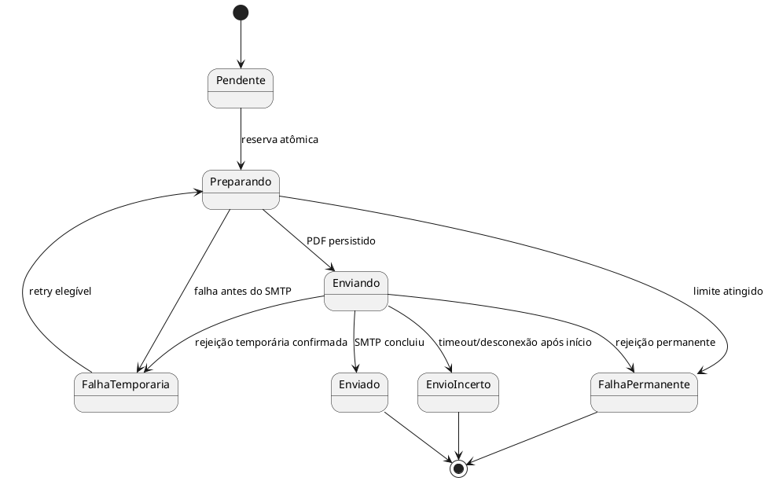
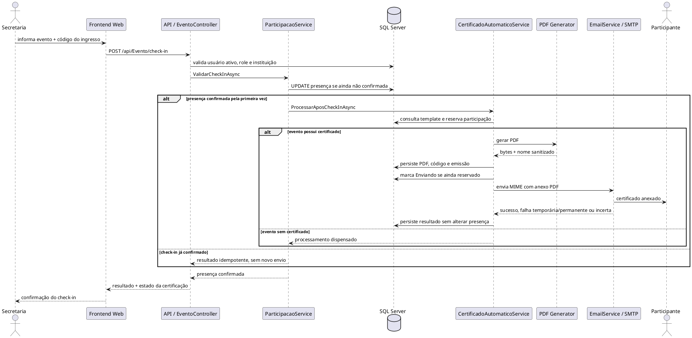

# Certificação Automática após Check-in

## Objetivo e gatilho

A certificação automática reaproveita o fluxo existente de `Participacao`, `Certificado`, `EmailService` e `AutomacaoEventosService`. Ela atende alunos FATEC e Público Geral sem duplicar modelos ou serviços.

O gatilho é a primeira confirmação efetiva de presença feita por Secretaria, operador de check-in ou Admin autorizado. Apresentar o ingresso ou ler o QR Code apenas fornece o `CodigoIngresso`; não altera a presença nem gera certificado. Aluno FATEC no Mobile e Público Geral em `Meus Ingressos` na Web apresentam o mesmo código aleatório da `Participacao`.

```text
Participacao inscrita
→ operador autorizado confirma presença
→ evento possui Certificado configurado
→ participação obtém reserva atômica
→ PDF é gerado e persistido
→ SMTP envia o PDF anexado
→ resultado do envio é persistido
```

Sem template configurado, o check-in termina com sucesso e nenhum certificado é criado.

## Arquitetura

| Componente | Responsabilidade |
| --- | --- |
| `EventoController` | Autentica o operador, valida role, vínculo institucional e entrada do check-in. |
| `ParticipacaoService` | Confirma a presença de forma idempotente e aciona a certificação somente na primeira confirmação. |
| `ParticipacaoRepository` | Executa a atualização atômica da presença, sem sobrescrever o estado do certificado. |
| `CertificadoAutomaticoService` | Reserva o processamento, coordena PDF, persistência, e-mail, retries e estados finais. |
| `ICertificadoPdfGenerator` | Define o contrato de geração independente da biblioteca concreta. |
| `CertificadoPdfGenerator` | Produz o arquivo com PDFsharp/MigraDoc e nome sanitizado. |
| `EmailService` | Monta a mensagem SMTP, anexa o PDF e classifica o resultado. |
| `AutomacaoEventosService` | Reprocessa falhas temporárias elegíveis e trata reservas expiradas. |

Não há MediatR, domain events, fila ou outbox na arquitetura atual. O processamento usa o banco como coordenador, mantendo a solução proporcional aos serviços e ao worker já existentes.

## Participantes e modelo de dados

`Aluno` representa o participante autenticado:

- `TipoParticipante.Interno`: aluno FATEC, com instituição e e-mail institucional;
- `TipoParticipante.Externo`: Público Geral, cadastrado pela web.

Os dois tipos usam a mesma `Participacao`, que liga `Aluno` e `Evento`. `Certificado` continua sendo o template configurado por evento. Os dados de uma emissão concreta ficam na participação porque a cardinalidade é uma emissão por inscrição.

### Campos de certificação em `Participacao`

| Campo | Finalidade |
| --- | --- |
| `CertificadoEmitido` | Compatibilidade e indicação de que houve emissão. |
| `CodigoValidacao` | Código estável impresso no PDF e usado no identificador da mensagem. |
| `CertificadoPdf` | Bytes do arquivo oficial em `varbinary(max)`. |
| `NomeArquivoCertificado` | Nome sanitizado do anexo/download. |
| `DataGeracaoCertificado` | Instante UTC em que o PDF foi gerado. |
| `DestinatarioCertificadoEmail` | Endereço usado na entrega, preservado para auditoria. |
| `StatusEnvioCertificado` | Estado atual do processamento/entrega. |
| `TentativasEnvioCertificado` | Quantidade de reservas de processamento realizadas. |
| `ProximaTentativaCertificadoUtc` | Momento mínimo para novo retry temporário. |
| `ProcessamentoCertificadoId` | Token exclusivo da instância que reservou a participação. |
| `ProcessamentoCertificadoAteUtc` | Prazo da reserva. |
| `CertificadoEnviadoPorEmail` | Compatibilidade e confirmação local de envio. |
| `DataEnvioCertificadoEmail` | Instante UTC da confirmação local. |
| `ErroEnvioCertificadoEmail` | Resumo limitado do erro ou da intervenção necessária. |

O índice `StatusEnvioCertificado + ProximaTentativaCertificadoUtc` atende a consulta periódica do worker.

## Estados e falhas



- Falha na geração ou preparação: o PDF pode ser tentado novamente e a presença permanece confirmada.
- Rejeição SMTP temporária conhecida: retry com espera exponencial, limitado por `Certificacao__MaxTentativas`.
- Rejeição SMTP permanente: estado final para análise.
- Timeout, desconexão ou reserva expirada durante `Enviando`: `EnvioIncerto`. Não há retry automático porque a mensagem pode ter sido entregue.
- Sucesso: grava `Enviado`, a data e limpa a reserva.

## Garantia contra duplicidade

O serviço usa `ExecuteUpdateAsync` com predicados de estado para adquirir uma reserva diretamente no banco. Apenas uma chamada altera a linha de um estado elegível para `Preparando` com seu `ProcessamentoCertificadoId`; concorrentes obtêm zero linhas afetadas e retornam o estado já salvo.

Antes do SMTP, uma segunda atualização condicional move somente o proprietário da reserva para `Enviando`. Depois que `CertificadoEnviadoPorEmail` é verdadeiro ou o estado é final, a linha deixa de ser elegível. O `Message-ID` determinístico inclui a participação e o código do certificado, ajudando a identificar a mesma entrega no provedor.

Essa garantia cobre duplo clique, repetição do endpoint, atualização de tela, leitura repetida do QR Code, várias instâncias da API e concorrência entre API e worker.

## PDF

O template `Unievent.Infra/Templates/CertificadoPdfTemplate.cs` gera A4 paisagem com o padrão laranja do UniEvent. O documento contém:

- nome completo do participante;
- evento e instituição organizadora;
- data do evento;
- responsável, quando cadastrado;
- texto livre do template de certificado;
- código de validação;
- data de emissão.

O modelo atual de `Evento` não possui carga horária; por isso o PDF não inventa esse dado. As fontes Liberation Sans regular e negrito são incorporadas para execução consistente em Windows, Linux e Docker.

## E-mail e consulta posterior

O serviço gera HTML com valores escapados e anexa os mesmos bytes persistidos no banco como `application/pdf`. O destinatário vem do cadastro de `Aluno`, atendendo ambos os tipos de participante.

O participante autenticado pode consultar seus estados em `GET /api/Certificado/meus` e baixar o próprio arquivo em `GET /api/Certificado/eventos/{eventoId}/pdf`. A consulta exige role `Aluno`, cruza o identificador do token com `Participacao.AlunoId`, exige presença e emissão, e responde sem cache. O mobile e a web pública usam esses endpoints; nenhum deles confirma presença.

## Segurança

`POST /api/Evento/check-in` exige Admin, Secretaria ou OperadorCheckIn. A participação também precisa manter `StatusInscricao.Ativa`; uma inscrição cancelada é recusada antes da confirmação. Para Secretaria e operador, o backend:

1. obtém o usuário pelo `NameIdentifier` do JWT;
2. confirma que ele ainda está ativo e aprovado;
3. exige a role operacional atual no banco;
4. compara sua instituição com `Evento.InstituicaoId`;
5. valida o par evento/código, a inscrição e a janela de horário em São Paulo.

Isso impede que um token antigo de usuário revogado, a troca de um ID na requisição, um aluno ou um participante externo confirmem presença administrativamente.

## Sequência

O diagrama abaixo também está disponível em [`DIAGRAMA_SEQUENCIA_CERTIFICACAO.puml`](DIAGRAMA_SEQUENCIA_CERTIFICACAO.puml).



## Migration e compatibilidade

`20260910163741_AddCertificadoPdfDelivery` adiciona os campos e o índice sem remover tabelas ou migrations antigas. Dados legados são classificados assim:

- `CertificadoEnviadoPorEmail = true` → `Enviado`;
- `CertificadoEmitido = true` sem confirmação de envio → `EnvioIncerto`;
- demais participações → `Pendente`.

Essa conversão preserva presença, códigos e datas existentes e evita que uma implantação reenvie certificados antigos sem saber se já foram entregues.
