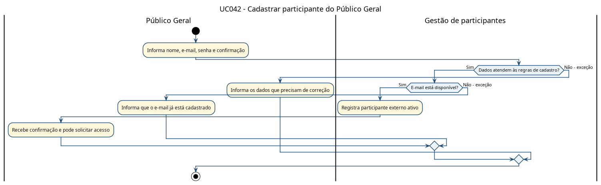
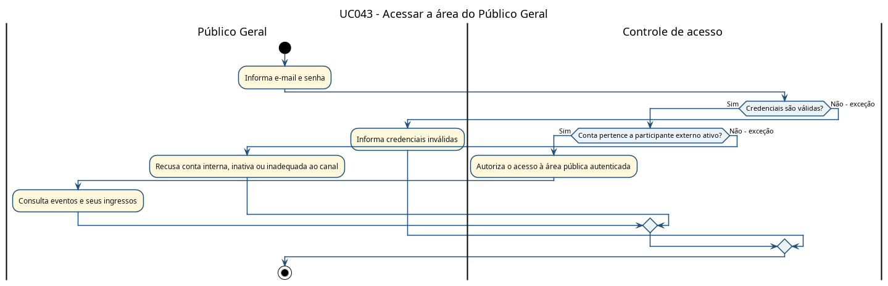
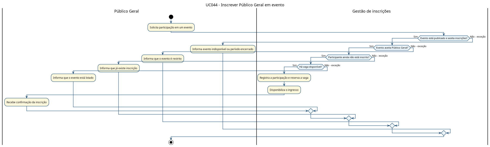
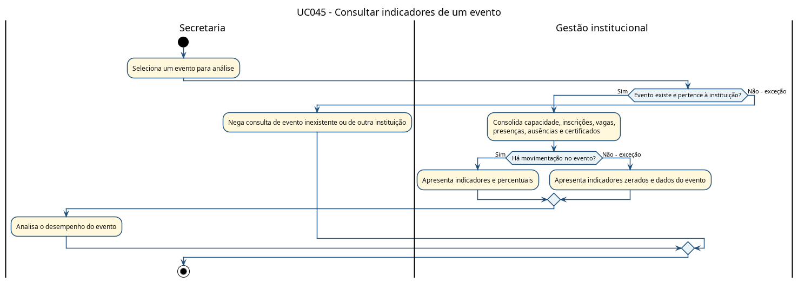
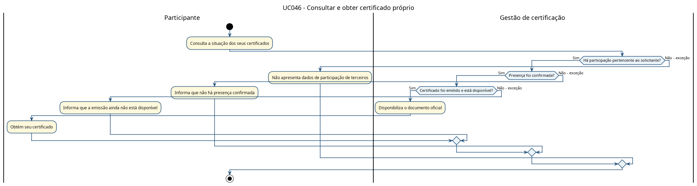

# UniEvent - Diagramas de Atividades com Imagens

Este documento reúne os PNGs renderizados dos 47 diagramas de atividades de negócio. Cada fluxo inclui suas decisões e exceções aplicáveis, sem detalhar arquitetura ou implementação.

## UC001 - Acessar landing page

[Arquivo PlantUML](diagramas-atividade/UC001_Acessar_landing_page.puml)

## UC002 - Descobrir eventos públicos

[Arquivo PlantUML](diagramas-atividade/UC002_Descobrir_eventos_publicos.puml)

## UC003 - Filtrar eventos por instituição

[Arquivo PlantUML](diagramas-atividade/UC003_Filtrar_eventos_por_instituicao.puml)

## UC004 - Ver detalhes do evento

[Arquivo PlantUML](diagramas-atividade/UC004_Ver_detalhes_do_evento.puml)

## UC005 - Cadastrar aluno institucional

[Arquivo PlantUML](diagramas-atividade/UC005_Cadastrar_aluno_institucional.puml)

## UC006 - Selecionar instituição

[Arquivo PlantUML](diagramas-atividade/UC006_Selecionar_instituicao.puml)

## UC007 - Confirmar e-mail

[Arquivo PlantUML](diagramas-atividade/UC007_Confirmar_email.puml)

## UC008 - Realizar login mobile

[Arquivo PlantUML](diagramas-atividade/UC008_Realizar_login_mobile.puml)

## UC009 - Consultar eventos disponíveis

[Arquivo PlantUML](diagramas-atividade/UC009_Consultar_eventos_disponiveis.puml)

## UC010 - Ver detalhes do evento no mobile

[Arquivo PlantUML](diagramas-atividade/UC010_Ver_detalhes_do_evento_no_mobile.puml)

## UC011 - Favoritar evento

[Arquivo PlantUML](diagramas-atividade/UC011_Favoritar_evento.puml)

## UC012 - Inscrever-se em evento

[Arquivo PlantUML](diagramas-atividade/UC012_Inscrever_se_em_evento.puml)

## UC013 - Visualizar meus eventos

[Arquivo PlantUML](diagramas-atividade/UC013_Visualizar_meus_eventos.puml)

## UC014 - Visualizar ingresso

[Arquivo PlantUML](diagramas-atividade/UC014_Visualizar_ingresso.puml)

## UC015 - Exibir QR Code do ingresso

[Arquivo PlantUML](diagramas-atividade/UC015_Exibir_QR_Code_do_ingresso.puml)

## UC016 - Gerenciar perfil

[Arquivo PlantUML](diagramas-atividade/UC016_Gerenciar_perfil.puml)

## UC017 - Configurar preferências

[Arquivo PlantUML](diagramas-atividade/UC017_Configurar_preferencias.puml)

## UC018 - Realizar login web

[Arquivo PlantUML](diagramas-atividade/UC018_Realizar_login_web.puml)

## UC019 - Cadastrar admin inicial

[Arquivo PlantUML](diagramas-atividade/UC019_Cadastrar_admin_inicial.puml)

## UC020 - Gerenciar instituições

[Arquivo PlantUML](diagramas-atividade/UC020_Gerenciar_instituicoes.puml)

## UC021 - Cadastrar instituição

[Arquivo PlantUML](diagramas-atividade/UC021_Cadastrar_instituicao.puml)

## UC022 - Editar instituição

[Arquivo PlantUML](diagramas-atividade/UC022_Editar_instituicao.puml)

## UC023 - Ativar ou desativar instituição

[Arquivo PlantUML](diagramas-atividade/UC023_Ativar_ou_desativar_instituicao.puml)

## UC024 - Gerenciar usuários secretaria

[Arquivo PlantUML](diagramas-atividade/UC024_Gerenciar_usuarios_secretaria.puml)

## UC025 - Cadastrar usuário secretaria

[Arquivo PlantUML](diagramas-atividade/UC025_Cadastrar_usuario_secretaria.puml)

## UC026 - Aprovar, bloquear ou recusar secretaria

[Arquivo PlantUML](diagramas-atividade/UC026_Aprovar_bloquear_ou_recusar_secretaria.puml)

## UC027 - Consultar dashboard administrativo

[Arquivo PlantUML](diagramas-atividade/UC027_Consultar_dashboard_administrativo.puml)

## UC028 - Executar automações manualmente

[Arquivo PlantUML](diagramas-atividade/UC028_Executar_automacoes_manualmente.puml)

## UC029 - Consultar dashboard da instituição

[Arquivo PlantUML](diagramas-atividade/UC029_Consultar_dashboard_da_instituicao.puml)

## UC030 - Gerenciar eventos da instituição

[Arquivo PlantUML](diagramas-atividade/UC030_Gerenciar_eventos_da_instituicao.puml)

## UC031 - Cadastrar evento

[Arquivo PlantUML](diagramas-atividade/UC031_Cadastrar_evento.puml)

## UC032 - Editar evento

[Arquivo PlantUML](diagramas-atividade/UC032_Editar_evento.puml)

## UC033 - Excluir evento

[Arquivo PlantUML](diagramas-atividade/UC033_Excluir_evento.puml)

## UC034 - Definir público permitido

[Arquivo PlantUML](diagramas-atividade/UC034_Definir_publico_permitido.puml)

## UC035 - Gerenciar responsáveis

[Arquivo PlantUML](diagramas-atividade/UC035_Gerenciar_responsaveis.puml)

## UC036 - Gerenciar certificados

[Arquivo PlantUML](diagramas-atividade/UC036_Gerenciar_certificados.puml)

## UC037 - Validar check-in

[Arquivo PlantUML](diagramas-atividade/UC037_Validar_check_in.puml)

## UC038 - Informar código do QR Code

[Arquivo PlantUML](diagramas-atividade/UC038_Informar_codigo_do_QR_Code.puml)

## UC039 - Verificar janela de horário

[Arquivo PlantUML](diagramas-atividade/UC039_Verificar_janela_de_horario.puml)

## UC040 - Emitir certificado automaticamente

[Arquivo PlantUML](diagramas-atividade/UC040_Emitir_certificado.puml)

## UC041 - Entregar certificado por e-mail

[Arquivo PlantUML](diagramas-atividade/UC041_Enviar_certificado_por_email.puml)

## UC042 - Cadastrar Público Geral

[Arquivo PlantUML](diagramas-atividade/UC042_Cadastrar_publico_geral.puml)

## UC043 - Realizar login do Público Geral

[Arquivo PlantUML](diagramas-atividade/UC043_Realizar_login_publico_geral.puml)

## UC044 - Inscrever Público Geral em evento

[Arquivo PlantUML](diagramas-atividade/UC044_Inscrever_publico_geral_em_evento.puml)

## UC045 - Consultar indicadores de um evento

[Arquivo PlantUML](diagramas-atividade/UC045_Consultar_dashboard_individual_evento.puml)

## UC046 - Consultar e obter certificado próprio

[Arquivo PlantUML](diagramas-atividade/UC046_Consultar_baixar_certificado_proprio.puml)

## UC047 - Consultar Meus Ingressos

[Arquivo PlantUML](diagramas-atividade/UC047_Consultar_meus_ingressos.puml)

