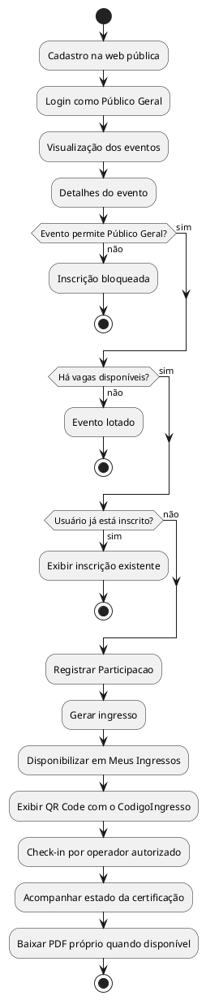
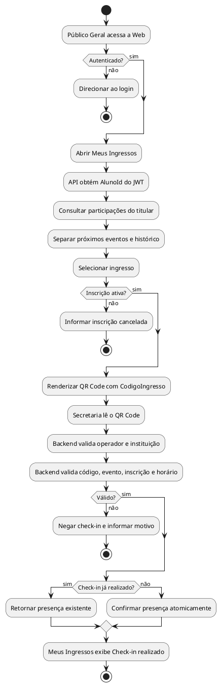
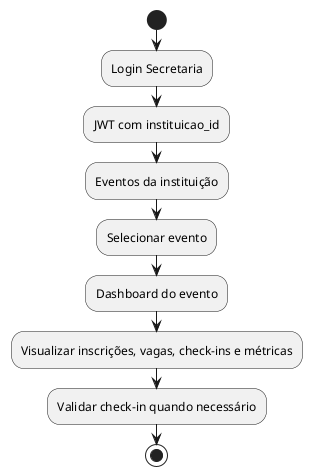
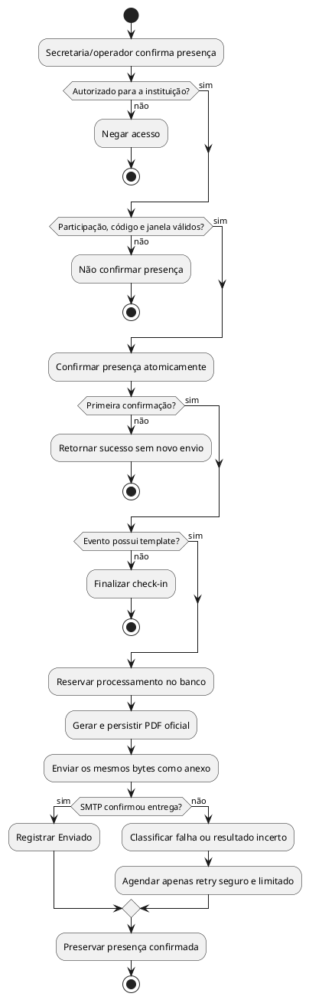
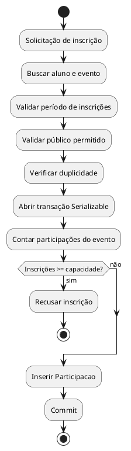

# Fluxos: Público Geral, Secretaria E Capacidade

## Fluxo Público Geral

O Público Geral é armazenado como `Aluno` com `TipoParticipante.Externo`. Isso permite reutilizar `Participacao`, ingresso, QR Code, check-in e certificados sem criar um fluxo paralelo de inscrição.

## Fluxo De Meus Ingressos E Check-in Web

O QR Code não contém dados pessoais, JWT ou o ID numérico da participação. Seu conteúdo é somente `Participacao.CodigoIngresso`, um valor aleatório gerado por inscrição e protegido por índice único. O Web usa `qrcode.react`; o Mobile mantém `react-native-qrcode-svg`; ambos codificam o mesmo valor entregue pela API. O backend continua sendo a fonte da verdade para titularidade, status da inscrição, evento, horário, operador e instituição.

## Fluxo Secretaria

A Secretaria só consulta dashboards de eventos vinculados à própria instituição. O backend compara `Evento.InstituicaoId` com a claim `instituicao_id` do JWT por meio de `CanAccessInstituicao`.

No check-in, o backend também relê o usuário institucional. Tokens emitidos antes de um bloqueio ou revogação não bastam: a conta precisa continuar ativa, aprovada e com role operacional compatível.

## Fluxo De Certificação Automática

Aluno FATEC e Público Geral percorrem o mesmo fluxo porque ambos usam `Aluno` e `Participacao`. A configuração `Certificado` pertence ao evento; o PDF emitido e seu estado de entrega pertencem à participação. Veja detalhes de arquitetura e dados em [CERTIFICACAO_AUTOMATICA.md](CERTIFICACAO_AUTOMATICA.md).

## Regra De Capacidade

Fonte da verdade:

`Vagas disponíveis = Evento.Capacidade - quantidade de Participacao ativa do evento`

Não existe campo persistido para vagas restantes. A API calcula a disponibilidade ao listar ou detalhar eventos e na dashboard por evento.

## Endpoints Envolvidos

- `POST /api/Auth/cadastro-publico`: cria conta do Público Geral.
- `POST /api/Auth/login-publico`: autentica Público Geral e retorna JWT.
- `GET /api/Evento`: lista eventos e calcula vagas disponíveis.
- `GET /api/Evento/{id}`: detalha evento e calcula vagas disponíveis.
- `POST /api/Evento/{id}/inscrever-se`: registra inscrição respeitando público, duplicidade, período e capacidade.
- `GET /api/Evento/{id}/minha-inscricao`: informa se o participante autenticado já está inscrito.
- `GET /api/Evento/meus-ingressos`: lista ingressos usando exclusivamente o `NameIdentifier` do JWT.
- `GET /api/Evento/{id}/ingresso`: detalha somente o ingresso do participante autenticado naquele evento.
- `GET /api/Evento/{eventId}/dashboard`: dashboard individual do evento para Admin/Secretaria autorizados.
- `POST /api/Evento/check-in`: confirma presença administrativamente e dispara a certificação na primeira confirmação.
- `GET /api/Certificado/meus`: retorna somente as participações do participante autenticado.
- `GET /api/Certificado/eventos/{eventoId}/pdf`: retorna somente o PDF próprio com presença confirmada.
- `POST /api/Automacoes/processar-agora`: processamento manual restrito ao Admin global.

## Segurança

- Público Geral não acessa endpoints administrativos porque mantém role técnica `Aluno`.
- Aluno FATEC e Público Geral não possuem operação para confirmar a própria presença.
- Secretaria/operador não valida check-in de outra instituição porque o backend cruza evento, claim e usuário institucional ativo.
- Trocar o identificador do evento não contorna o vínculo institucional nem a correspondência do código do ingresso.
- A API de ingressos não aceita `userId`; alterar o identificador do evento só retorna um ingresso quando a participação pertence ao usuário autenticado.
- Inscrição com `StatusInscricao.Cancelada` permanece no histórico, não consome vaga e é recusada pelo check-in.
- Check-in repetido é idempotente: a atualização condicional confirma presença uma vez e não gera múltiplos registros.
- O download cruza o identificador do JWT com a participação e não revela certificados de terceiros.
- Regras de público permitido são verificadas no backend por `EventoRules.PodeParticipar`.
- Inscrição duplicada é bloqueada por regra de serviço e índice único `(AlunoId, EventoId)`.
- A última vaga é protegida por transação com isolamento `Serializable`.
